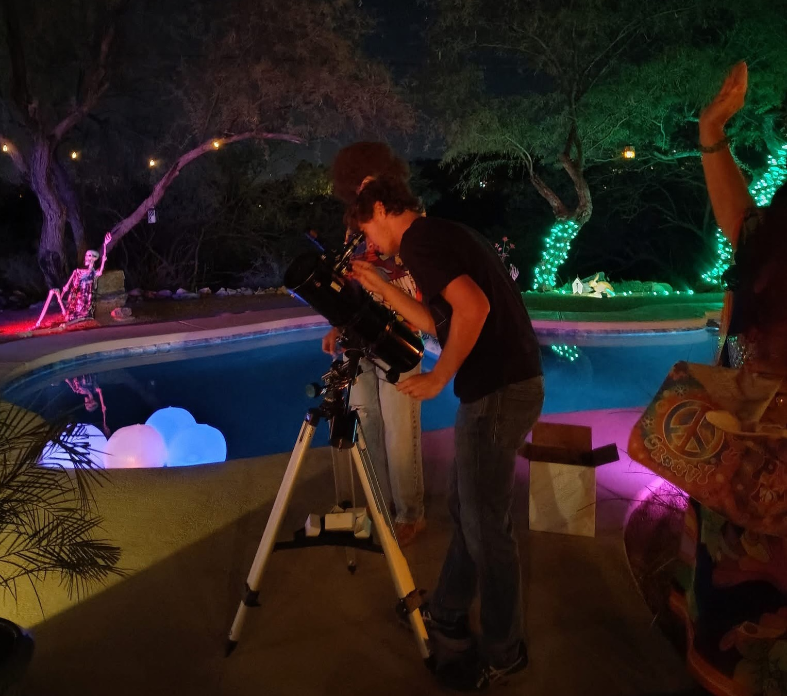
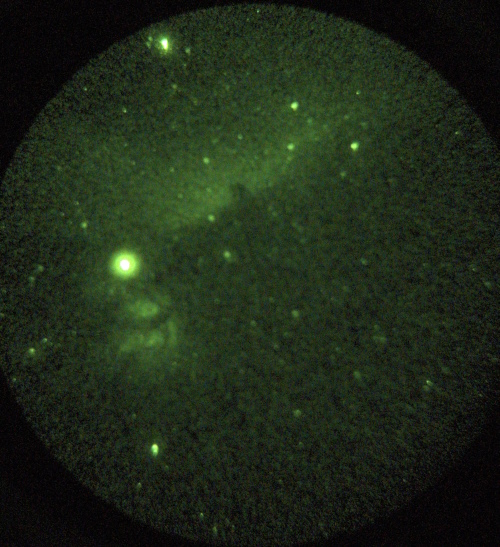

# Star Party Bookings

Experience the night sky like never before with a private star party. Utilizing my large telescopes, I can provide fantastic views of the Moon, planets, star clusters, galaxies, nebulae, and more (most nebulae and galaxies will require reasonably dark conditions for a good view). I have telescopes available up to 22" in aperture as well as a PVS-7 night vision device for viewing nebulae even under fairly poor conditions, such as the Horsehead Nebula in the image below:

## Pricing & Details

Approximate pricing for events local to Tucson is as follows for small Groups (20 or fewer guests):

- **$150 for 1 hour**
- **$225 for 2 hours**
- **$275 for 3 hours**

*Pricing is subject to change depending on event specifics - this is just a base estimate. Please contact me to discuss further details and requirements.*

For more details and to discuss larger group sizes, please [contact me](https://astrozane.com/links/contact).

For events further outside the Tucson metro area, I am willing to travel for an additional cost.

---

## Telescope Repair and Assistance

In addition to star party bookings, I offer services for telescope repair and setup. Whether you need help fixing a telescope, or want guidance on using one for a night of stargazing, I am available to assist. Feel free to reach out for more information. For recommendations on choosing telescopes or accessories, I highly recommend visting telescopicwatch.com first before contacting me about further details. If you are in the Tucson or Phoenix area, I am happy to help in person.

For inquiries, please [contact me](https://astrozane.com/links/contact).