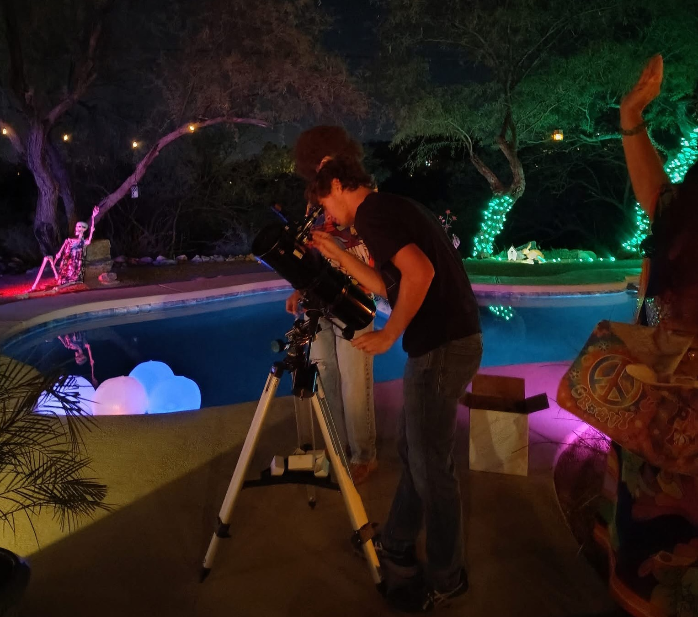

# Star Party Bookings

Experience the night sky like never before. Using my telescopes and years of hands-on observing, I can show you the Moon, planets, star clusters, galaxies, and nebulae in remarkable detail. Every session is tailored to your group — whether that's a birthday, a corporate outing, a private gathering, or simply a night out under the stars.

I bring excellent telescopes, along with a PVS-14 night vision device that pulls crisp views of nebulae out of the sky even when conditions aren't ideal.

**Now booking private events for August, September, November, and December 2026.**

## Why Book With Me

I've been sharing the night sky for over ten years, with experience through DarkSky Southern Arizona, NSF's NOIRLab, the Huachuca Astronomy Club, the Westport Observatory, and running the Stamford Observatory. Here's what sets my events apart:

- **A genuine, unplugged experience.** No computers, no screens — you get to look through a real eyepiece (or analog photointensifier device) and I find everything we can see in the night sky without a computer.
- **Plenty to see.** I'll guide you through a wide range of objects in a single night, so there's always something new to look at.
- **Fun for all ages.** Whether your group is kids, adults, or a mix, the experience stays engaging and easy to enjoy — no background knowledge needed.
- **Optional presentation.** I can add a short PowerPoint talk to set the scene before you head to the telescopes.
- **Dependable skies.** Southern Arizona has some of the clearest, darkest skies in the country, which means far fewer weather cancellations than most places.
- **Built around you.** I'll work with your venue, schedule, and preferences to shape the right event for your group.

## Private Star Parties

Approximate pricing for events local to Tucson, for small groups of 20 or fewer guests:

- **$180** — 1 hour
- **$300** — 2 hours
- **$450** — 3 hours

*These are base estimates. Final pricing depends on group size, location, and event specifics.* For larger groups or a custom experience, [get in touch](https://astrozane.com/links/contact) and we'll work out the details.

**Not sure how long you need?** If you mainly want to see the Moon and planets, a shorter session is ideal — those targets are bright, so a dark sky isn't necessary and even an hour delivers memorable views. For fainter deep-sky objects like galaxies and nebulae, a longer session away from city lights is worth it.

I'm also happy to travel for events outside the Tucson metro area for an additional cost — Southern Arizona has some of the darkest skies in the country, and I know where to find them.

---

## Stargazing at Mount Lemmon Lodge

On select Saturday evenings, I host stargazing events at the [Mount Lemmon Lodge](https://mountlemmonlodge.com/), high in the Santa Catalina Mountains above Tucson. Up there the air is thinner, the seeing is spectacularly good, and the sky is quite dark — a completely different experience from observing down in the city.

If you're staying at the Lodge, it's a perfect way to spend an evening under a truly dark sky with telescopes and a guide on hand. Check the Lodge's [event calendar](https://mountlemmonlodge.com/mount-lemmon-event-calender/) for upcoming star party dates.

---

## The Telescopes

The main telescopes I typically use are:

- **6" f/4.3 Newtonian** — Very wide field of view for night vision or star clusters, also great on the Moon and planets. Mirror handmade by me.
- **Celestron C8** — Ideal for the Moon/planets and short sessions - very sharp optics and motorized tracking.
- **14.7" f/2.9 Dobsonian** — Homemade structure and other parts by me, great for deep-sky views, especially with night vision. Has motorized tracking too.
- **22" f/4.3 Obsession Ultra-Compact** - Ideal for dark skies and viewing galaxies, globular clusters etc. close up.

In addition, I bring a PVS-14 night vision device to all my events, which can be used at 1x/3x without a telescope as well as coupled to my telescopes with a hydrogen-alpha filter.

You'll also get to try out some of my finest astronomy binoculars, which are great for viewing the Milky Way and large star clusters, especially from a comfortable seat.

---

## Telescope Repair & Assistance

Beyond star parties, I also help with telescope repair and setup. Whether your scope needs fixing or you'd like hands-on guidance to get the most out of a night under the stars, I'm available to help — in person if you're in the Tucson or Phoenix area.

Shopping for a telescope or accessories? I'd recommend starting at [telescopicwatch.com](https://telescopicwatch.com) for reviews and buying guides, then reaching out if you'd like a second opinion.

[Contact me](https://astrozane.com/links/contact) to book a session or ask a question.