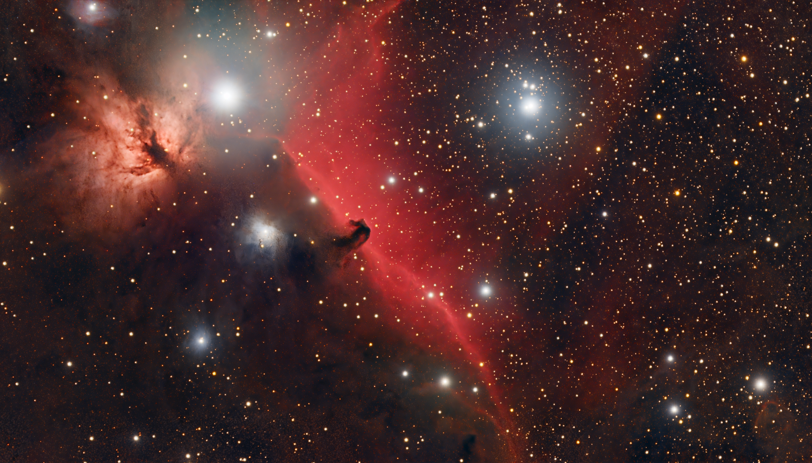
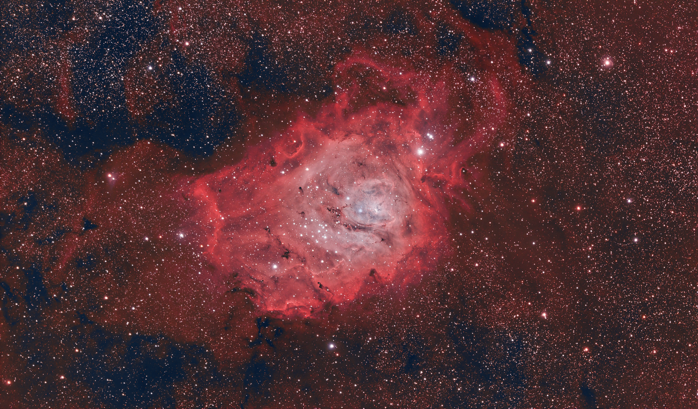
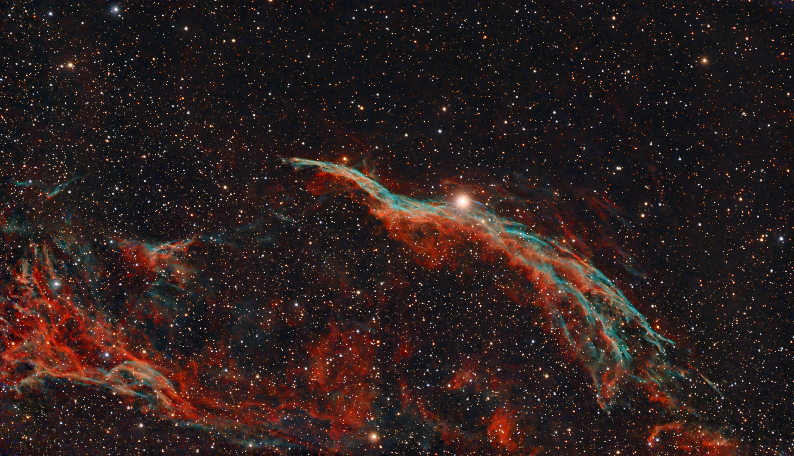
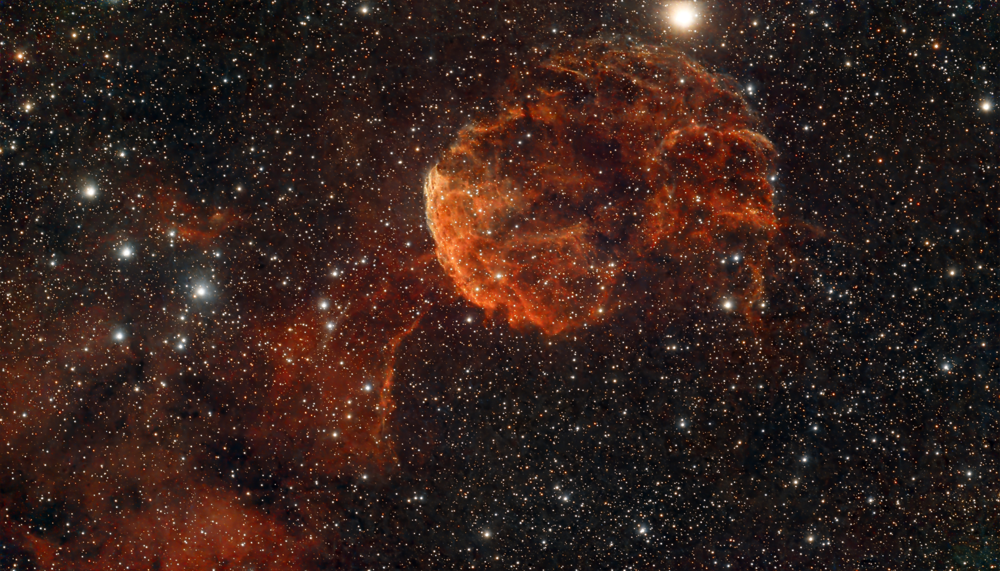
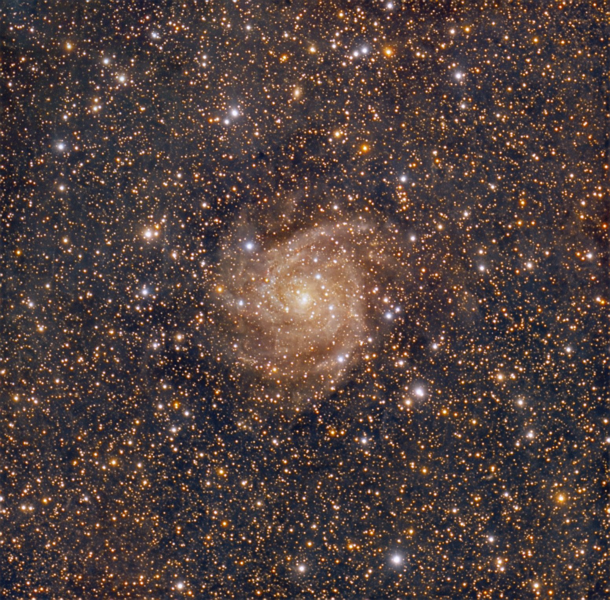
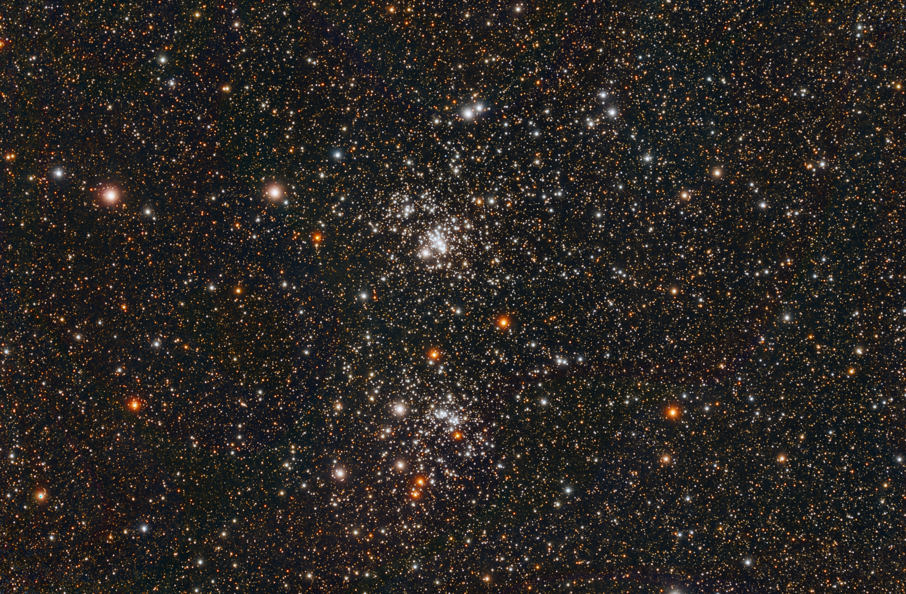
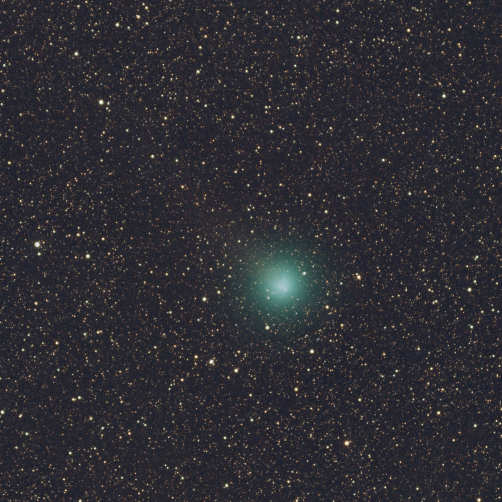
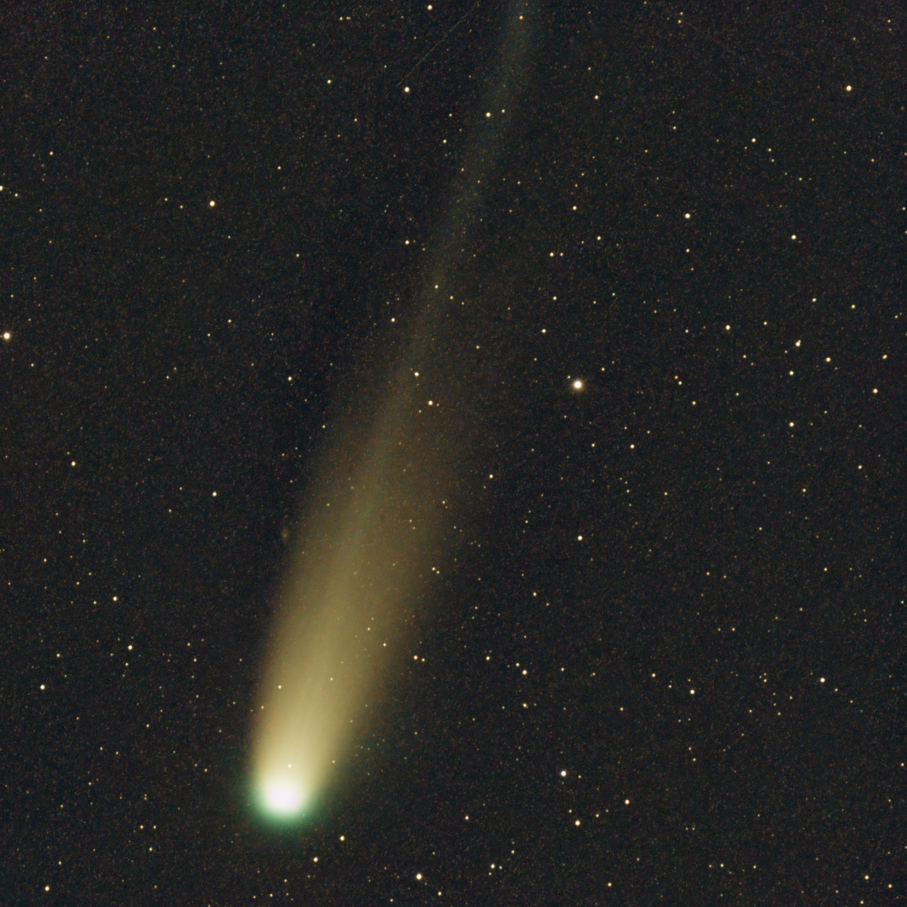

I was sent a Vaonis Vespera II smart telescope in July 2025. Here are some images I've taken with it. My review will be up shortly on TelescopicWatch.com.

These images were taken using the stock Vespera II with the included dual band/broadband filters, or unfiltered from a dark sky. Unless otherwise noted, I used 10s subs and did processing in the free Siril astroimage processing app.

These images load in full resolution by default thanks to the way my website is coded - if you're on a desktop, just right click to "open in new tab" - if you're on mobile, you can just zoom in or save the photos to your device.

## Nebulae

### Cone Nebula, Christmas Tree Cluster & Hubble's Variable Nebula - 22h

Entirely shot from my backyard, dual band filter.

### IC 59 & IC 63 - Ghost of Cassiopeia - 3h 30min

Shot from the Chiricahua Mountains, unfiltered.

### IC 2118 - Witch Head Nebula in Eridanus - 7h

Shot from the Chiricahua Mountains, unfiltered.

### IC 1805/1795 - Heart Nebula in Cassiopeia - 19h 35min

Entirely shot from my backyard, dual band filter.

### IC 434 & NGC 2024 - Horsehead & Flame Nebula in Orion - 8h

Shot mostly at home, dual band filter, with 45 mins of unfiltered data from the Okie-Tex Star Party.

### M42/M43 - Orion Nebula - 6h

### NGC 7293 - Helix Nebula in Aquarius - 7h 20min

Shot entirely from the Okie-Tex Star Party, unfiltered.

### NGC 6888 - Crescent Nebula in Cygnus - 9h

Entirely shot from my backyard, dual band filter.

### NGC 2237 - Rosette Nebula in Monoceros - 8h 45min

Entirely shot from my backyard, dual band filter. This one uses 20s subs rather than the usual 10.

### M8, the Lagoon Nebula in Sagittarius - 5h 45min

Shot from Sonoita Arizona, unfiltered. This one was processed by my friend Steve Labkoff in PixInsight with BlurXterminator - thanks Steve!

### IC 2177 - Seagull Nebula in Canis Major/Monoceros - 4h

Shot entirely from my backyard, dual band filter.

### M17 - Swan Nebula in Sagittarius - 4h 45min

Shot from Sonoita and Mt Graham Arizona, unfiltered.

### M78 - Reflection Nebula in Orion - 12h

Shot entirely from my backyard, unfiltered! I needed to remove the broadband filter to get this one as it's entirely a reflection nebula.

### NGC 1360 - Robin's Egg Nebula in Fornax - 7h 20min

Shot entirely from my backyard, dual band filter.

### NGC 6960 - Witch's Broom (Western Veil Nebula) in Cygnus - 13h

Shot with a mix of dual/broadband filters, 10s and 20s subs, from my backyard and Mt Graham.

### NGC 7380 - Wizard Nebula in Cepheus - 3h 30min

Entirely shot from my backyard, dual band filter.

### NGC 2359 - Thor's Helmet Nebula in Canis Major - 3h 52min

Entirely shot from my backyard, dual band filter.

### NGC 7822 - Emission Nebula in Cepheus - 14h 30min

Entirely shot from my backyard, dual band filter. 15s subs on this one.

### IC 443 - Jellyfish Nebula in Gemini - 15h

Entirely shot from my backyard, dual band filter.

### NGC 281 - Pacman Nebula in Cassiopeia - 11h

Entirely shot from my backyard, dual band filter.

### NGC 7000 - North America Nebula (Cygnus Wall) - 10h

Shot from my backyard and from the Chiricahua Sky Vilalge with full Moon, dual band filter.

### NGC 7008 - Planetary Nebula in Cygnus - 2h 50min

Shot from a mix of locations, dual band filter.

### IC 5146 - Cocoon Nebula in Cygnus - 10h 45min

Entirely shot from my backyard, broadband filter.

## Galaxies

### NGC 6946 - Fireworks Galaxy in Cepheus - 12h

Taken at the Okie-Tex Star Party, unfiltered, 20s subs.

### IC 342/Caldwell 5 - Hidden Galaxy in Camelopardalis - 19h 30min

Shot from my backyard, 20s subs, broadband filter.

### NGC 253 - Sculptor Galaxy - 3h

Shot from the Chiricahua Mountains, unfiltered.

### M31 - Andromeda Galaxy - 10h 20min

Shot from my backyard, 10s subs, broadband filter.

### M77 - Seyfert Galaxy in Cetus - 4h 20min

Shot from my backyard, 10s subs, broadband filter.

### M33 - Triangulum Galaxy - 8h 5min

Shot from the Chiricahua Mountains and Mt Graham unfiltered for around half
Remainder taken at home, broadband filter.

### NGC 7331 - Deer Lick Group in Pegasus - 5h 45min

Shot from my backyard, broadband filter. Supernova SN2025rbs is visible.

## Open Star Clusters

### NGC 869 & NGC 884 - Double Cluster in Perseus - 4h 43min

Shot from my backyard, broadband filter.

### M45 - Pleiades Open Cluster in Taurus - 2h 20min

Shot mostly at home, broadband filter. 45 mins of unfiltered data from the Okie-Tex Star Party.

### M11 - Wild Duck Cluster in Scutum - 2h 50min

Shot from my backyard, broadband filter.

### NGC 7789 - Caroline's Rose Open Cluster in Cassiopeia - 8h

Shot from my backyard, broadband filter.

## Comets

### Comet SWAN - 10-19-25 - 10 mins

Shot from TAAA Chiricahua Astronomy Complex, unfiltered.

### Comet Lemmon - 10-27-25 - 4 mins

Shot from my backyard, broadband filter.
