I was sent a Vaonis Vespera II smart telescope in July 2025. Here are some images I've taken with it. [I have a review of it on TelescopicWatch.com](https://telescopicwatch.com/vaonis-vespera-ii-review/)

These images were taken using the stock Vespera II with the included dual band/broadband filters, or unfiltered from a dark sky. Unless otherwise noted, I used 10s subs and did processing in the free Siril astroimage processing app.

These should load in full resolution by default thanks to the way my website is coded - if you're on a desktop, just right click to "open in new tab" - if you're on mobile, you can just zoom in or save the photos to your device.

## Emission & Reflection Nebulae

### Cone Nebula, Christmas Tree Cluster & Hubble's Variable Nebula

Entirely shot from my backyard, 22h, dual band filter. My longest total exposure image so far.

### IC 59 & IC 63 - Ghost of Cassiopeia

Shot from the Chiricahua Mountains, 3h 30min, unfiltered.

### IC 434 & NGC 2024 - Horsehead & Flame Nebula in Orion
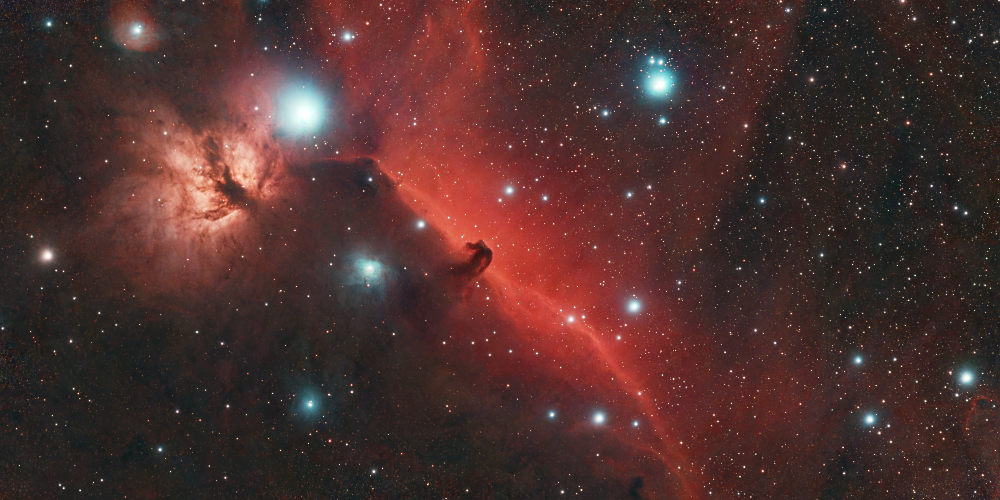

Shot mostly at home, 9h of 10s subs/dual band filter, 8h of 5s subs/dual band filter, with 45 mins of unfiltered data (10s subs) from the Okie-Tex Star Party. 17h 45min total.

### IC 1396 - Elephant Trunk Nebula in Cepheus
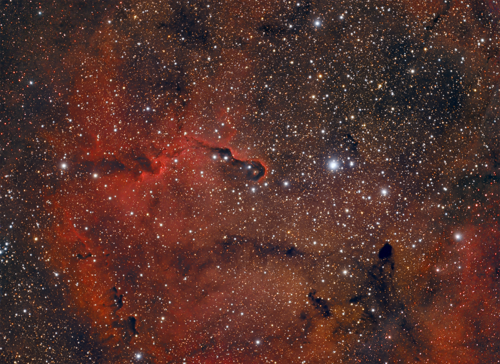

Entirely shot from my backyard, 23h 20min, dual band filter, 4h 20min of 15s subs, remaining 10s subs.

### IC 1805/1795 - Heart Nebula in Cassiopeia

Entirely shot from my backyard, 41 hours total exposure time, dual band filter.

### IC 2118 - Witch Head Nebula in Eridanus

Shot from the Chiricahua Mountains, 7h, unfiltered.

### IC 2177 - Seagull Nebula in Canis Major/Monoceros

Shot entirely from my backyard, 12h 45min, dual band filter.

### IC 5146 - Cocoon Nebula in Cygnus

Entirely shot from my backyard, 10h 45min, 20s subs, broadband filter.

### M8 - Lagoon Nebula in Sagittarius

Shot from Sonoita Arizona, 5h 45min unfiltered. This one was processed by my friend Steve Labkoff in PixInsight with BlurXterminator - thanks Steve!

### M17 - Swan Nebula in Sagittarius

Shot from Sonoita and Mt Graham Arizona, 4h 45min unfiltered.

### M42/M43 - Orion Nebula

2h from the Okie-Tex Star Party unfiltered, 4h from my backyard with broadband filter, f6h total.

### M78 - Reflection Nebula in Orion

Shot entirely from my backyard, 12h unfiltered! I needed to remove the broadband filter to get this one as it's entirely a reflection nebula.

### NGC 281 - Pacman Nebula in Cassiopeia

Entirely shot from my backyard, 11h, dual band filter.

### NGC 2174 - Monkey Head Nebula in Gemini
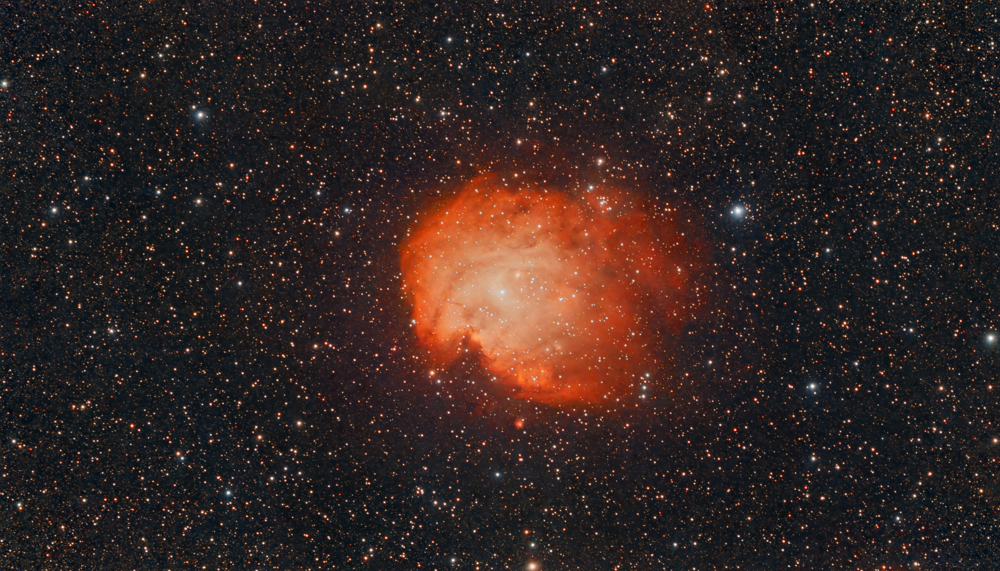

Shot from my backyard, dual band filter, 7h 30min total.

### NGC 2237 - Rosette Nebula in Monoceros
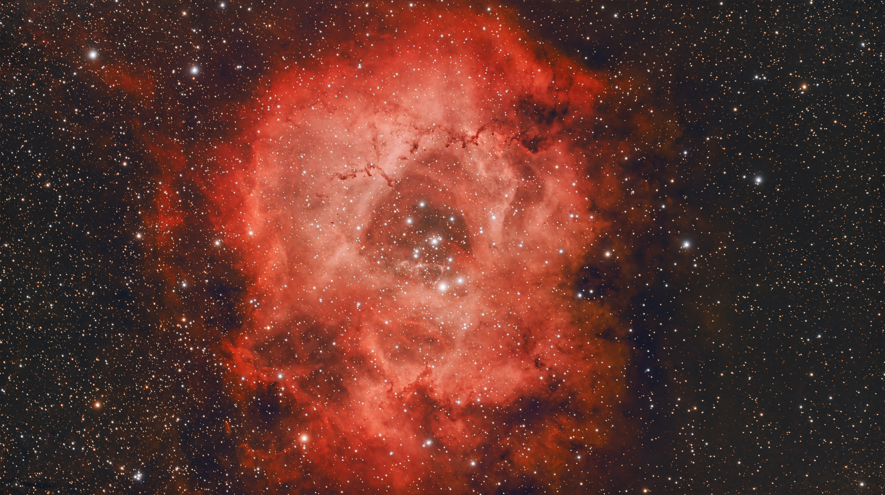

Entirely shot from my backyard, 14h 20min, dual band filter. This one uses 20s subs rather than the usual 10.

### NGC 7000 - North America Nebula (Cygnus Wall)
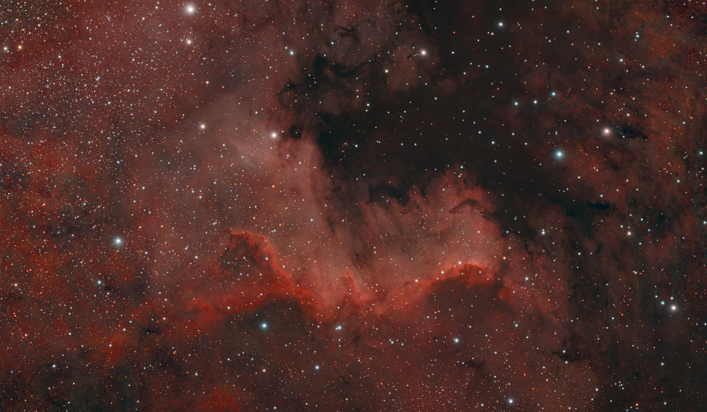

Shot from my backyard and from the Chiricahua Sky Village with full Moon, dual band filter, 10h total.

### NGC 7380 - Wizard Nebula in Cepheus
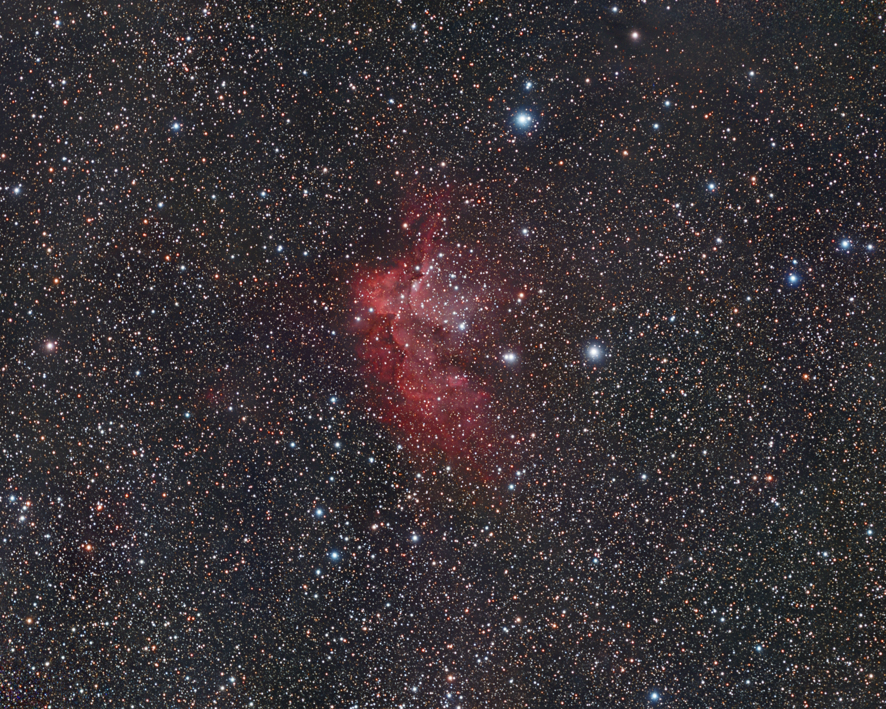

Entirely shot from my backyard, 3h 30min, dual band filter.

### NGC 7822 - Emission Nebula in Cepheus
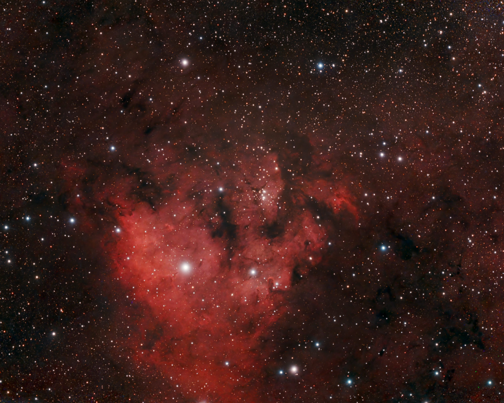

Entirely shot from my backyard, 14h 30min, dual band filter. 15s subs on this one.

## Wolf-Rayet Shell Nebulae

### NGC 2359 - Thor's Helmet Nebula in Canis Major 
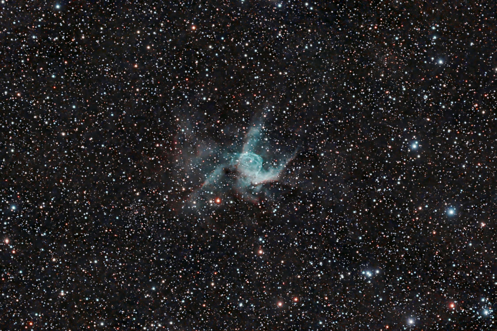

Entirely shot from my backyard, 10h 50min, dual band filter.

### NGC 6888 - Crescent Nebula in Cygnus

Entirely shot from my backyard, 9h, dual band filter.

## Supernova Remnants

### IC 443 - Jellyfish Nebula in Gemini
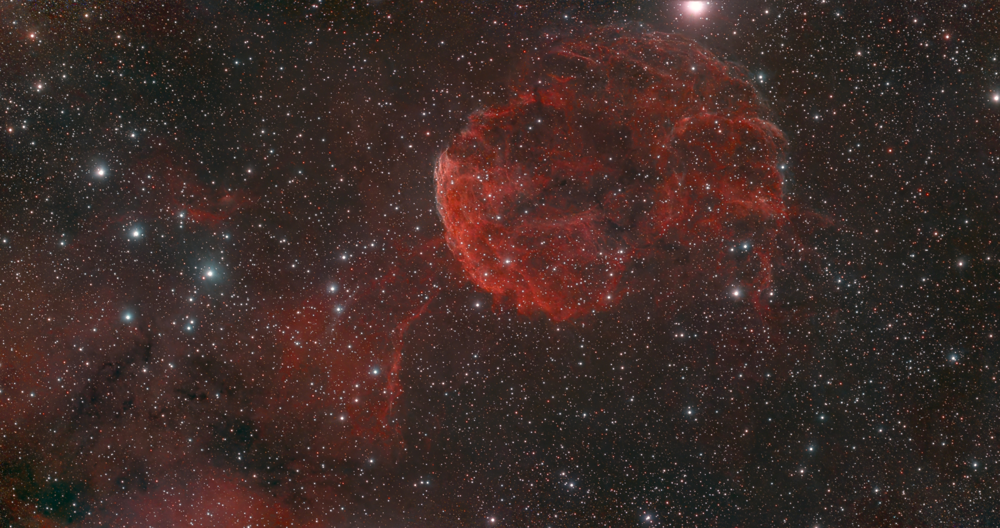

Entirely shot from my backyard, 23h 20min, dual band filter, 4h 20min of 15s subs, remaining 10s subs.

### M1 - Crab Nebula in Taurus

Entirely shot from my backyard, 3 hours of data, broadband filter.

### NGC 6960 - Witch's Broom (Western Veil Nebula) in Cygnus 

Shot with a mix of dual/broadband filters, 13h of 10s and 20s subs, from my backyard and Mt Graham.

### Mosaic - Veil Nebula in Cygnus 
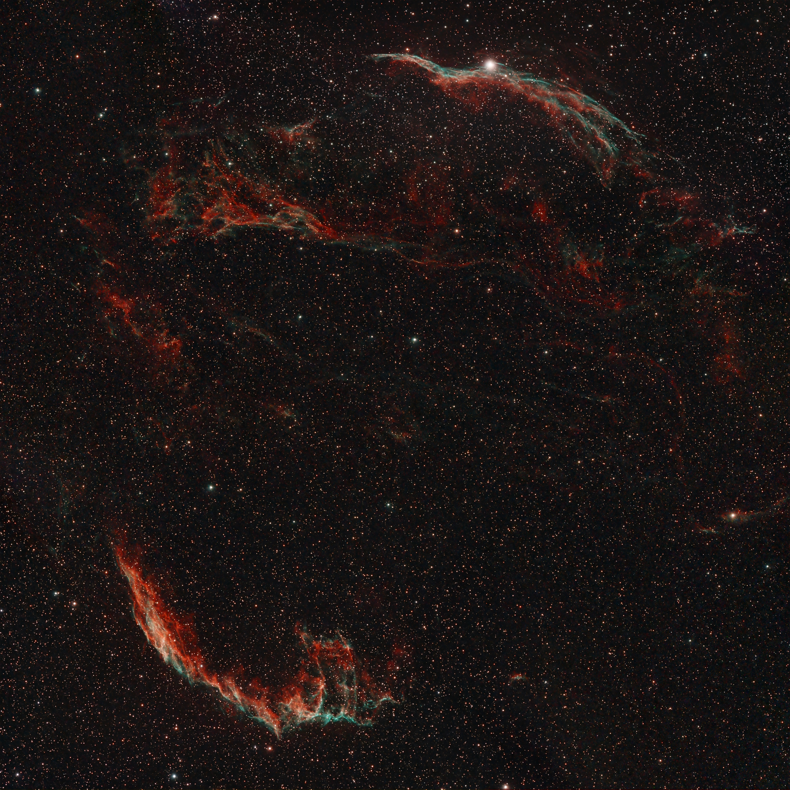

Shot with a mix of dual/broadband filters, 24h of 10s and 20s subs, from my backyard and Mt Graham. This is binned to 1/2 scale, still adding data for the full res version.

## Planetary Nebulae

### M27 - Dumbbell Nebula in Vulpecula
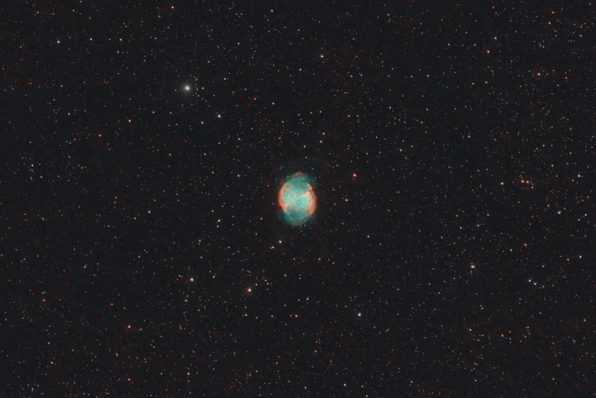

Shot from Mt Graham, AZ and from my backyard, broadband filter, 133 mins total.

### NGC 1360 - Robin's Egg Nebula in Fornax

Shot entirely from my backyard, 7h 20min, dual band filter.

### NGC 7008 - Planetary Nebula in Cygnus

Shot from a mix of locations, 2h 50min total, dual band filter.

### NGC 7293 - Helix Nebula in Aquarius

Shot entirely from the Okie-Tex Star Party, 7h 20min, unfiltered.

## Galaxies

### IC 10 - Irregular Galaxy in Cassiopeia

Shot from my backyard, 6h, 10s subs, broadband filter.

### IC 342/Caldwell 5 - Hidden Galaxy in Camelopardalis

Shot from my backyard, 19h 30min, 20s subs, broadband filter.

### M31 - Andromeda Galaxy
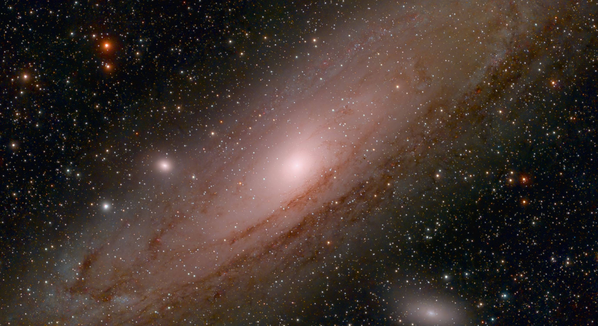

Shot from my backyard, 10h 20min, 10s subs, broadband filter.

### M33 - Triangulum Galaxy
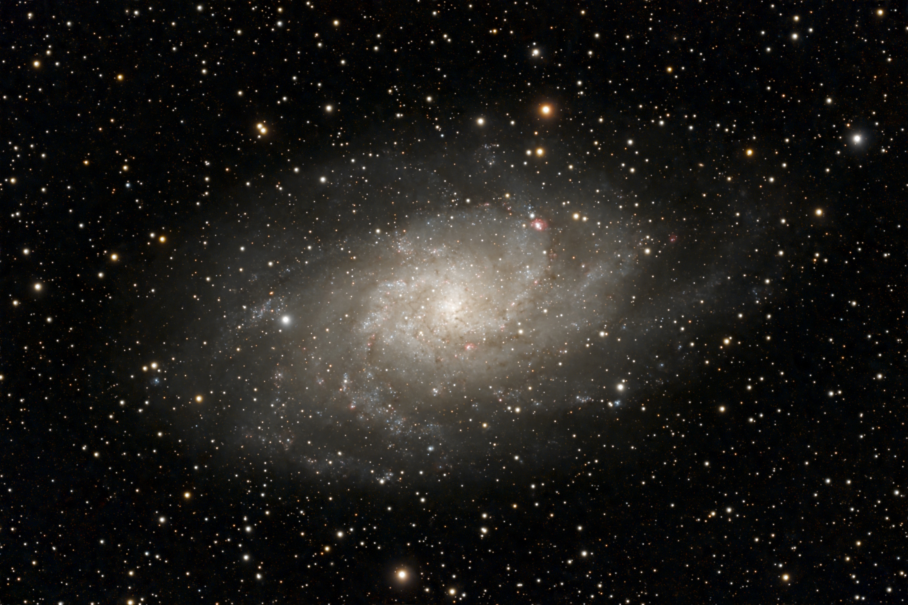

Shot from the Chiricahua Mountains and Mt Graham unfiltered for around half
Remainder taken at home, 45 mins of at-home data with dual band filter, 8h 5min total exposure time, remaining 7h 20min with broadband filter.

### M77 - Seyfert Galaxy in Cetus

Shot from my backyard, 4h 20min, 10s subs, broadband filter.

### NGC 147 & 185 - Andromeda Galaxy Satellites in Cassiopeia
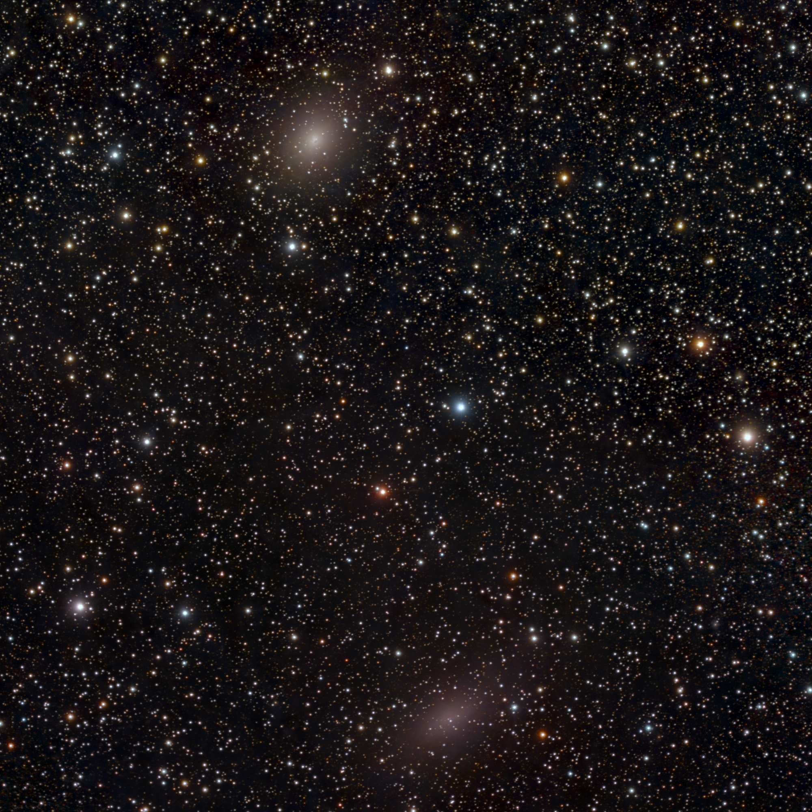

Shot from my backyard, 10h, 10s subs, broadband filter.

### NGC 253 - Sculptor Galaxy
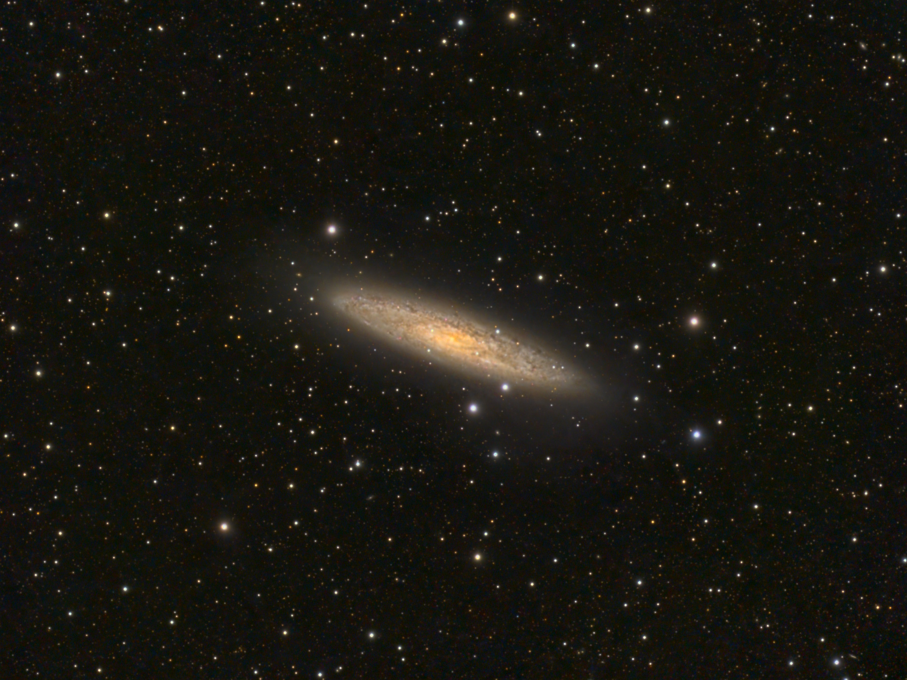

Shot from the Chiricahua Mountains, 3h unfiltered. I actually did 13 hours total (50% from home, 50% from the Chiricahuas) but Vespera's auto-focus failed and ruined most of the data.

### NGC 6946 - Fireworks Galaxy in Cepheus

Taken at the Okie-Tex Star Party, unfiltered, 12h total exposure time, 20s subs.

### NGC 7331 - Deer Lick Group in Pegasus

Shot from my backyard, 5h 45min, broadband filter. Supernova SN2025rbs is visible.

## Open Star Clusters

### M11 - Wild Duck Cluster in Scutum

Shot from my backyard, 2h 50min, broadband filter.

### M45 - Pleiades/Subaru Cluster in Taurus 

Shot mostly at home, 1h 40min with broadband filter, 40 mins of unfiltered data from the Okie-Tex Star Party, total 2h 20min.

### NGC 869 & NGC 884 - Double Cluster in Perseus

Shot from my backyard, 4h 43min, broadband filter.

### NGC 7789 - Caroline's Rose Cluster in Cassiopeia

Shot from my backyard, 8h, broadband filter.

## Comets

### Comet SWAN - 10-19-25

Shot from TAAA Chiricahua Astronomy Complex, 10 mins, unfiltered.

### Comet Lemmon - 10-27-25

Shot from my backyard, 4 mins, broadband filter.
