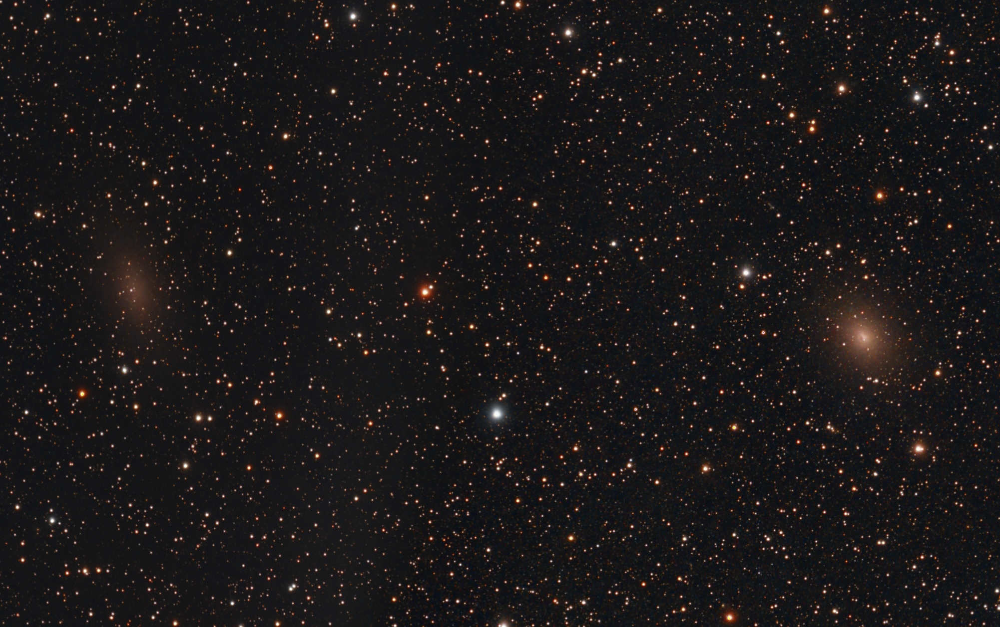

Additional images that I'm not entirely done with yet.

## Emission & Reflection Nebulae

### NGC 7822 - Emission Nebula in Cepheus

Entirely shot from my backyard, 14h 30min, dual band filter. 15s subs on this one.

## Supernova Remnants

### M1 - Crab Nebula SN1054 in Taurus

Entirely shot from my backyard, 4h 20min, broadband filter.

## Galaxies

### NGC 147 & 185 - Andromeda Galaxy Satellites in Cassiopeia

Shot from my backyard, 10h, 10s subs, broadband filter.

## Globular Star Clusters

### M13 - Great Hercules Cluster

Shot from my backyard, 4h, broadband filter.

### M15 - Pegasus Cluster

Shot from my backyard, 4h, broadband filter. This is exactly to the same scale as the image of M13.

