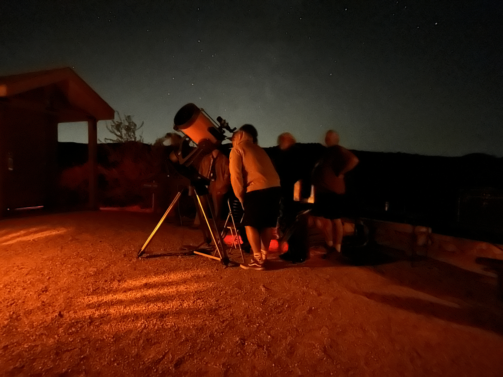

In today's digitally saturated world, astronomy outreach, particularly in the form of impromptu sidewalk astronomy, provides invaluable experiences. It connects people with the cosmos in a direct, tangible way. While technology often mediates our interactions, gazing through a telescope offers a profound and memorable experience, tapping into the wonder and curiosity that screens frequently diminish. Electronic assisted astronomy (EAA), though useful in scientific contexts, often involves viewing celestial objects on yet another screen. In a time when we are inundated with digital images, these can become just another moment in a sea of pixels.

Sidewalk astronomy, however, provides an unmediated connection. It turns distant worlds from abstract concepts into vivid realities, witnessed firsthand. The sheer thrill of seeing the rings of Saturn or the craters on the Moon through a telescope often leaves a lasting impression, igniting a lifelong interest in science and exploration. 

If you're interested in booking your own private event at home or for your venue., [head on over to my booking page](https://astrozane.com/about/booking).

## Sidewalk Astronomy on University Blvd

### Schedule

- **November 28** 5:30 PM - 9:30 PM
- **December 4** 6:00 PM - 9:00 PM
- **December 5** 5:30 PM - 9:30 PM
- **December 6** 5:30 PM - 9:30 PM
- **December 11** 6:00 PM - 9:00 PM
- **December 12** 5:30 PM - 9:30 PM
- **January 1** 5:30 PM - 9:30 PM
- **January 2** 5:30 PM - 9:30 PM
- **January 3** 5:30 PM - 9:30 PM
- **January 8** 6:00 PM - 9:00 PM
- **January 22** 5:30 PM - 9:30 PM
- **January 23** 5:30 PM - 9:30 PM
- **January 24** 5:30 PM - 9:30 PM

## Photos

