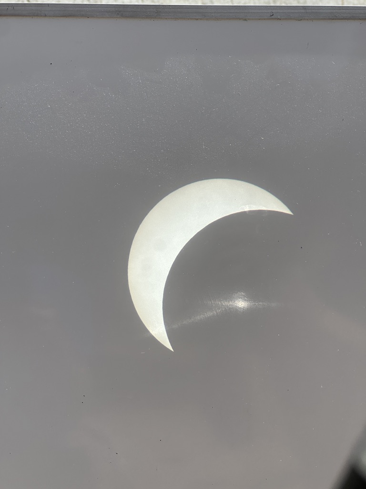
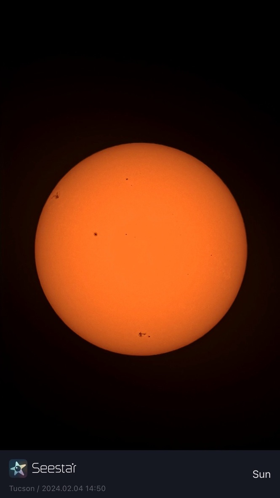

I don't do a lot of astrophotography - there are much better images available online for free and most objects in space don't change on human time scales. However, I used to have a deep-sky rig (a Takahashi FC-76 guided atop a Sky-Watcher HEQ5) and do occasionally snap photos through other telescopes. I am presently borrowing a Vaonis Vespera II which can take some really nice images.

## Deep Sky - Vaonis Vespera II
### NGC 6960 - West Veil Nebula/Witch's Broom

### NGC 7000 - North America Nebula

### M11 - Wild Duck Cluster

## Deep Sky - Takahashi FC76 + Canon T3i
### M13 - Globular Cluster in Hercules

### NGC 7789 - Caroline's Rose

## Deep Sky - ZWO SeeStar
### IC 434 - Horsehead Nebula

### Rosette Nebula

### M42 - Orion Nebula

## The Moon
### The Moon - Takahashi FC76 + Canon T3i

### The Moon - Hadley Telescope + iPhone 14 Pro

### 2018 Lunar Eclipse - Celestron C90 + Canon T3i

### 2019 Lunar Eclipse - Celestron C14 EdgeHD - iPhone 11

## The Sun

### 2024 Partial Solar Eclipse - Mayflower 60mm Refractor

### Sunspots - ZWO SeeStar
