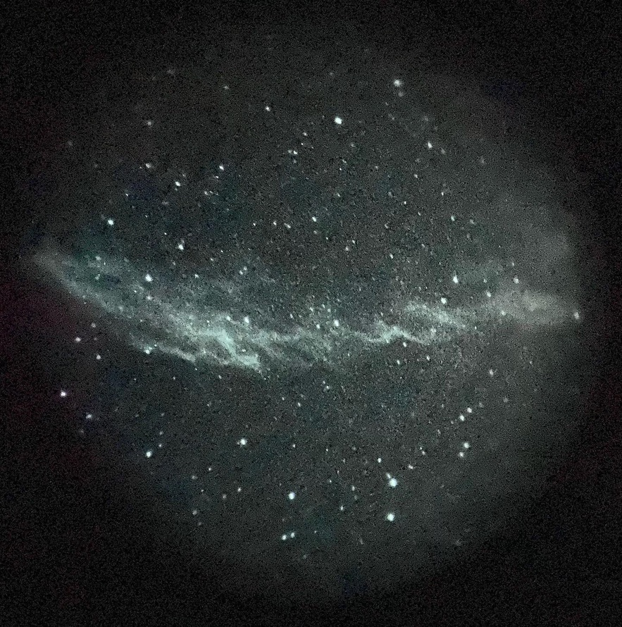

I don't do a lot of astrophotography - there are much better images available online for free and most objects in space don't change on human time scales. However, I used to have a deep-sky rig (a Takahashi FC-76 guided atop a Sky-Watcher HEQ5) and do occasionally snap photos through other telescopes.

# Deep Sky - Takahashi FC76 + Canon T3i
## M13 - Globular Cluster in Hercules

## M51 - The Whirlpool Galaxy

## NGC 7789 - Caroline's Rose

## NGC 7000 - part of the North American Nebula

# Deep Sky - ZWO SeeStar
## IC 434 - Horsehead Nebula

## Rosette Nebula

## M31 - Andromeda Galaxy

## M33 - Triangulum Galaxy

## M41 - Open Cluster

## M42 - Orion Nebula

# Deep Sky - 14.7" Dob + PVS-14

All of these were taken at Okie-Tex 2022 with Will (deepskydude)'s PVS-14

## Crescent Nebula

## Pac-Man Nebula

## Witch's Broom Nebula

## Sculptor Galaxy

# The Moon
## The Moon - Takahashi FC76 + Canon T3i

## The Moon - Hadley Telescope + iPhone 14 Pro

# Lunar eclipses - various telescopes

## 2018 Lunar Eclipse - Celestron C90 + Canon T3i

## 2019 Lunar Eclipse - Celestron C14 EdgeHD - iPhone 11
