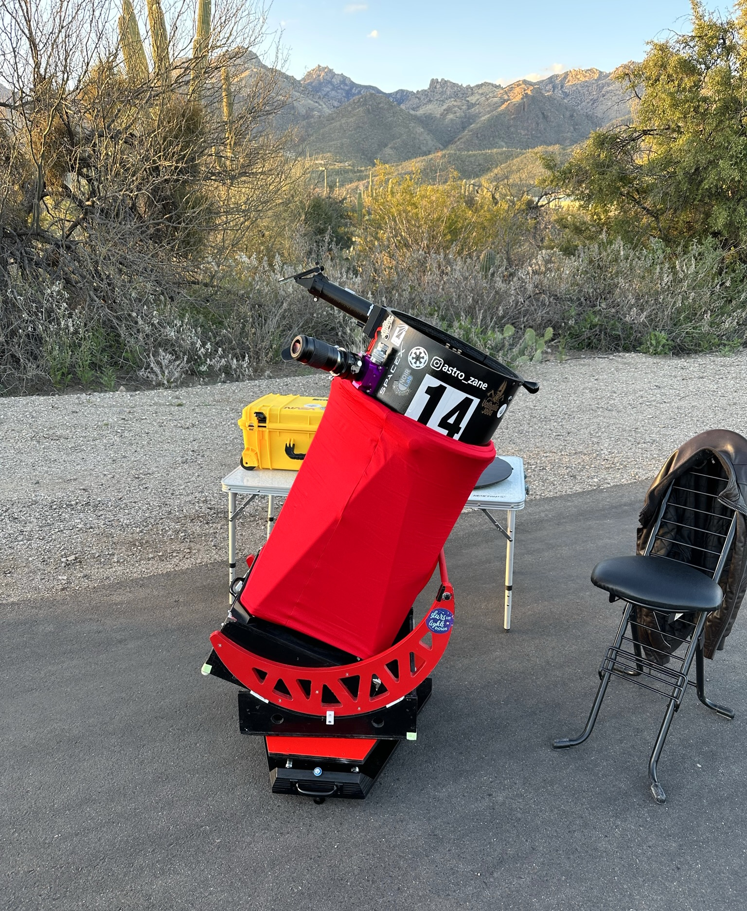
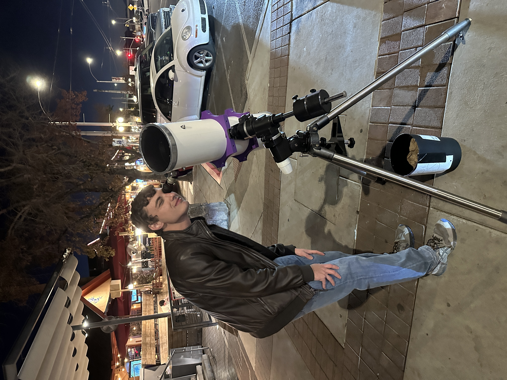
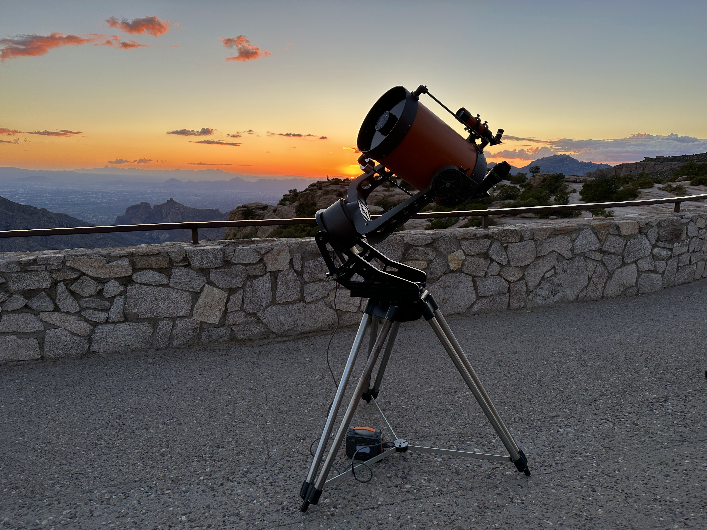
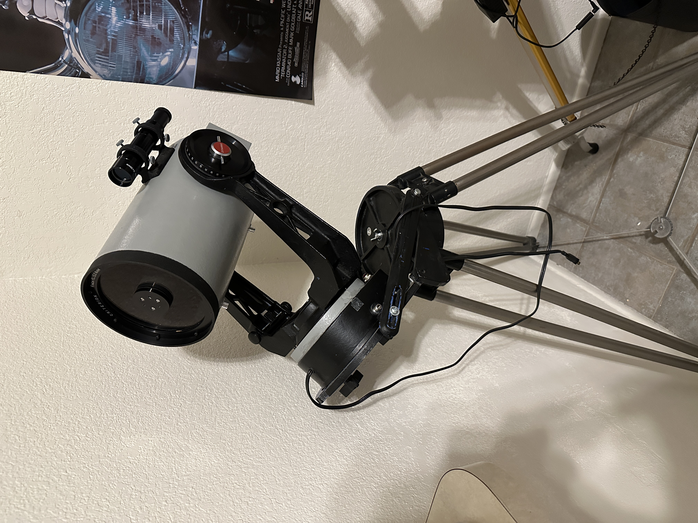
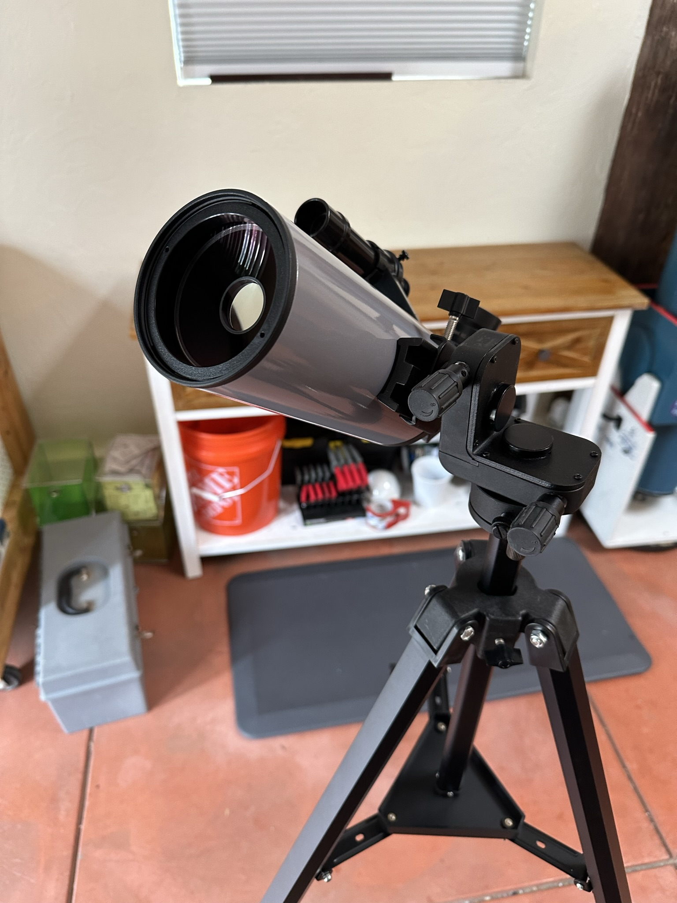

# Scopes I Use:

## Reflectors
14.7" f/2.9 Dob

Coulter Odyssey 1 13.1" f/4.5

John Dobson 8" f/6

6" f/4.3 Newtonian

## Schmidt-Cassegrains (SCT)
Celestron C11

Criterion Dynamax 6

## Maksutov-Cassegrains (MCT)
Intes MK63

Meade ETX-90RA

SarBlue Mak70

## Refractors

Meade #312 (80mm f/11)