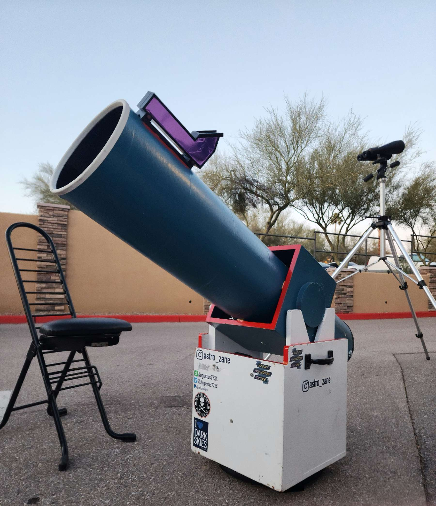
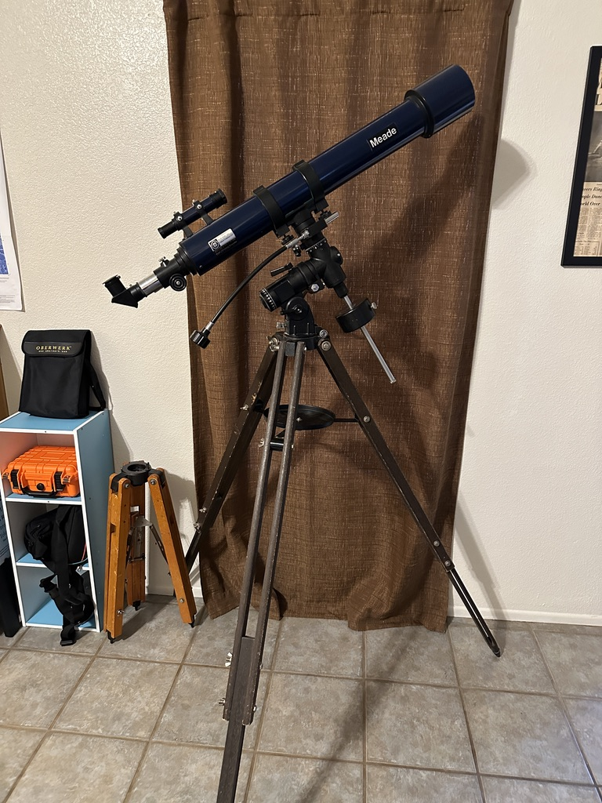

I have owned over 470 telescopes. [The full list is here.](https://docs.google.com/document/d/10u__j-BPwaRjkedsvcIMpclY8nEwKfm2i86mk1ffOos/edit?usp=drive_link)

Currently I observe with my 14.7" f/2.9 Dob and a Celestron C11 Schmidt-Cassegrain, with my 6" f/4.3 for wide-field views. Most of my other telescopes are used for outreach events or quick lunar/planetary views at home.

## Reflectors
### [14.7" f/2.9 Dob built by me](https://astrozane.com/projects/147-inch-f29/)

### John Dobson 8" f/6 built circa 1985

Yes, this scope was built by *the* John Dobson himself. I have been told by several people they saw him using it around 1985 in San Francisco. It is extremely sharp optically. It was given to me at Stellafane 2021 and I have used it extensively since.

I added numerous upgrades such as a new ground board, helical 2" focuser, and a better mirror cell. Secondary mirror still is attached to a spider made out of roofing shingles.

### [6" f/4.3 Newtonian built by me](https://astrozane.com/projects/6inch-f4/)

## Schmidt-Cassegrains (SCT)
### Celestron C8 built circa 1980

TBD

## Maksutov-Cassegrains (MCT)
### Intes MK63 built 1992

One of the earliest Maksutovs to be imported from Russia shortly after the fall of the USSR, the Intes MK63 is the same telescope as the MK65 but with a fork mount and a 60mm f/25 Mak guide scope which I sold to a friend. I printed some hardware to fit the mount on a surveyor tripod, since the wooden one it came with was fragile and far from steady. Very good views, although there is some glare on account of a lack of secondary baffling. This scope has no internal focuser or rear-attached unit; focusing is accomplished with a helical threaded holder on the diagonal. Rather fast for a Maksutov at a focal ratio of f/10.

### Meade ETX-90RA built 1996

I have had a lot of ETXes; my first, like this one, was an RA unit with a non-working clock drive (thankfully this one lacks the fungus on the corrector which my first had). It has flown across the US with me and I can use it on both its #881 tabletop legs or the #884 heavy duty tripod.

### SarBlue Mak70 2022

I have 2 of these presently, the second was purchased for a video review. Very good lunar, planetary, and double star instruments.

## Refractors

### Meade #312 (80mm f/11) built late 1970s

I found this telescope on Craigslist. It is one of the best achromats I have used; the tube and mount were both made by Mizar in Japan. The mount is a little cumbersome to take apart so I mostly use it in my backyard. The Orion SkyView Deluxe (made by GSO) happens to be a near-exact copy of the Mizar mount so I took a polar scope and clock drive off one and put it on the 312.