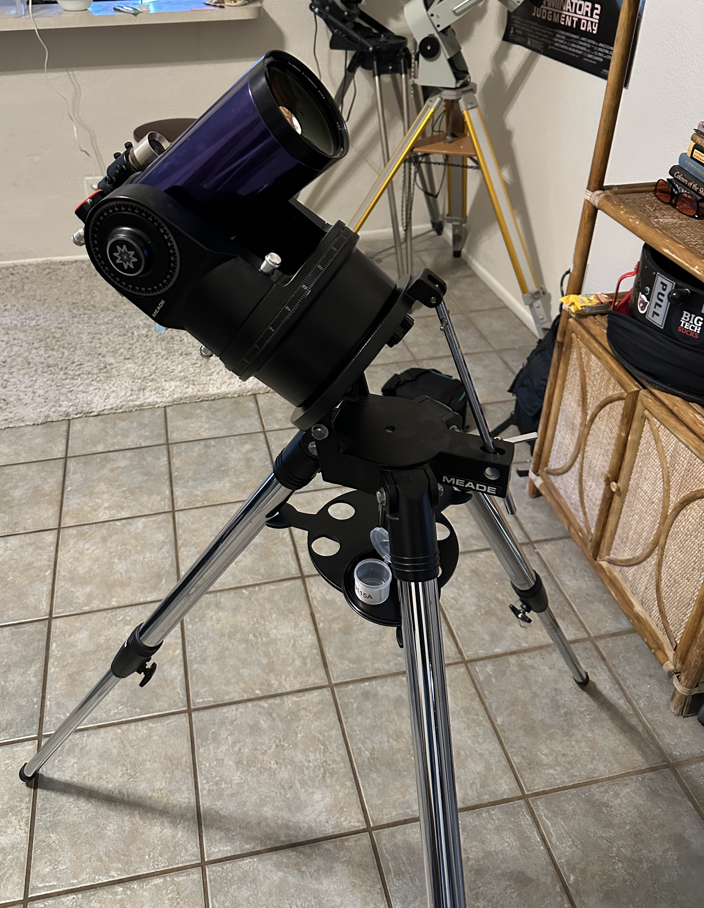

# Scopes I Use:

I have owned over 470 telescopes. [The full list is here.](https://docs.google.com/document/d/10u__j-BPwaRjkedsvcIMpclY8nEwKfm2i86mk1ffOos/edit?usp=drive_link)

Currently

## Reflectors
### [14.7" f/2.9 Dob built by me](https://astrozane.com/projects/147-inch-f29/)

### Coulter Odyssey 1 13.1" f/4.5 built circa 1981

Upgraded with a 2" focuser and a smoother, lighter weight ground board. Very sharp views.

### John Dobson 8" f/6 built circa 1985

I added numerous upgrades such as a new ground board, helical 2" focuser, and a better mirror cell. Secondary mirror still is attached to a spider made out of roofing shingles.

### [6" f/4.3 Newtonian built by me](https://astrozane.com/projects/6inch-f4/)

## Schmidt-Cassegrains (SCT)
### Celestron C11 built circa 1978

My second orange C11 (the first was mounted on a CGEM). Like the last one I've seen the Encke gap with it thanks to the razor-sharp optics. The tube detaches from the forks for easy setup/packing in just a few minutes.

### Criterion Dynamax 6 built circa 1977

One of the few of these that is good optically. The forks are blue, but someone painted them and the wedge black.

## Maksutov-Cassegrains (MCT)
### Intes MK63 built 1992

### Meade ETX-90RA built 1996

### SarBlue Mak70 circa 2020

## Refractors

### Meade #312 (80mm f/11) late 1970s
