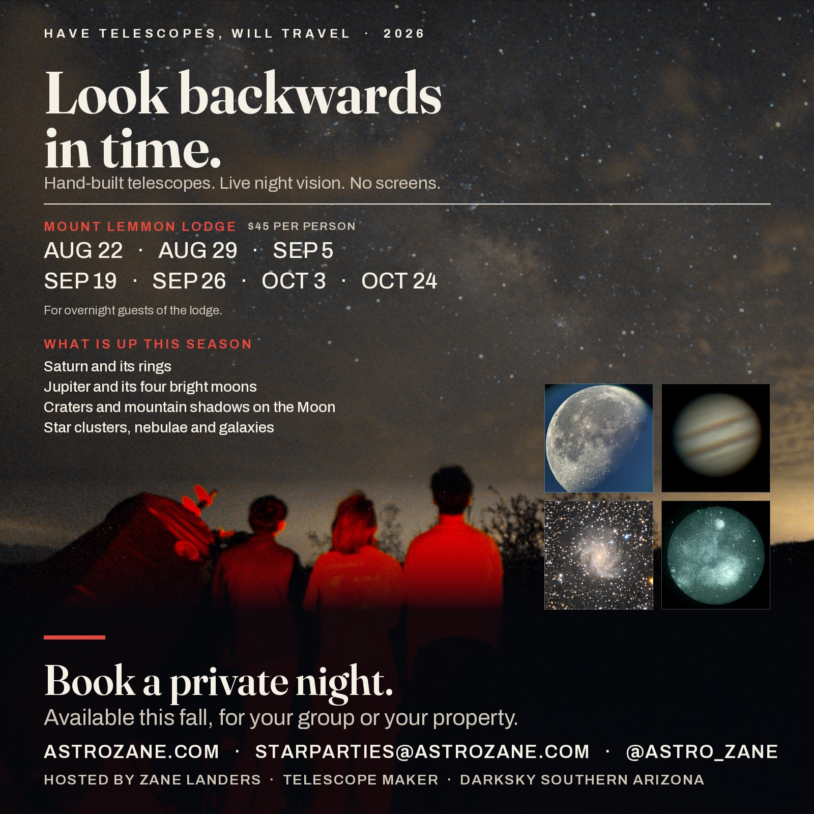

# Star Party Bookings

Experience the night sky like never before. Using my telescopes and years of hands-on observing, I can show you the Moon, planets, star clusters, galaxies, and nebulae in remarkable detail. Every session is tailored to your group - whether that's a birthday, a corporate outing, your resort, a private gathering, or simply a night out under the stars.

I bring my homemade 14.7" and 6" telescopes plus pairs of binoculars for guests, along with a PVS-14 night vision device that pulls nebulae out of the sky even when conditions aren't ideal.

**Now booking private events for November 2026 through May 2027.**

## Private Star Parties in Tucson, Phoenix & Southern Arizona

While most of my events are in and around Tucson, I regularly travel throughout Southern Arizona — including Oro Valley, Marana, Vail, Green Valley, Sahuarita, and Sierra Vista — as well as farther out to Phoenix, Flagstaff, Las Cruces, and San Diego for larger or destination events.

## Why Book a Star Party With Me?

## Why Book a Star Party With Me?

For over ten years I've been showing people the night sky — thousands of them, from impromptu looks at the Moon on a street corner to week-long events like the Okie-Tex Star Party. I build my own telescopes from scratch, grinding the mirrors by hand; I've tested and reviewed hundreds more; and I serve on the board of DarkSky Southern Arizona.

Here's what sets my events apart:

- **A genuine, unplugged experience.** No computers, no screens — everything is found and tracked by hand at the eyepiece, the way stargazing is meant to be. When you're not looking through a telescope, I'll provide binoculars for you to explore the sky with while you wait.
- **Plenty to see.** I'll guide you through a wide range of objects in a single night, and my hand-built telescopes and night vision device pull in detail even when conditions aren't perfect.
- **Fun for all ages.** Whether your group is kids, adults, or a mix, the experience stays engaging and easy to enjoy — no background knowledge needed.
- **Optional presentation.** I can add a short talk to set the scene before you head to the telescopes.
- **Dependable skies.** Southern Arizona and the wider Southwest have some of the clearest, darkest skies in the country, which means far fewer weather cancellations than most places.
- **Built around you.** I'll work with your venue, schedule, and preferences to shape the right event for your group.

## Pricing

Approximate pricing for events local to Tucson, for small groups of 20 or fewer guests:

- **$250** — 1 hour
- **$400** — 2 hours
- **$500** — 3 hours

*These are base estimates. Final pricing depends on group size, location, and event specifics.* For larger groups, a custom experience, or an event outside the Tucson metro area, [get in touch](https://astrozane.com/links/contact) and we'll work out the details.

**Not sure how long you need?** If you mainly want to see the Moon and planets, a shorter session is ideal — those targets are bright and easy to see, so a dark sky isn't necessary and even an hour delivers memorable views. For fainter deep-sky objects like galaxies and nebulae, a longer session away from city lights is worth it.

---

## Stargazing at Mount Lemmon Lodge

On select Saturday evenings, I host stargazing events at the [Mount Lemmon Lodge](https://mountlemmonlodge.com/), high in the Santa Catalina Mountains above Tucson. Up there the air is thin, the horizon is high, and the sky is genuinely dark — a completely different experience from observing down in the city.

If you're staying at the Lodge, it's a perfect way to spend an evening under a truly dark sky with telescopes and a guide on hand. Check the Lodge's [event calendar](https://mountlemmonlodge.com/mount-lemmon-event-calender/) for upcoming star party dates.

---

## Telescope Repair & Assistance

Beyond star parties, I also help with telescope repair and setup. Whether your scope needs fixing or you'd like hands-on guidance to get the most out of a night under the stars, I'm available to help — in person if you're in the Tucson or Phoenix area.

Shopping for a telescope or accessories? I'd recommend starting at [telescopicwatch.com](https://telescopicwatch.com) for reviews and buying guides, then reaching out if you'd like a second opinion.

[Contact me](https://astrozane.com/links/contact) to book a session or ask a question.

## Star Party FAQ

### What will we actually see?

It depends on the Moon, the season, and your location, but a typical session includes some mix of: the Moon in crater-by-crater detail, planets (Saturn's rings and Jupiter's moons are perennial crowd favorites), colorful double stars, star clusters, and — from darker locations — galaxies and nebulae. With my night vision device, nebulae are visible in real time with an amount of detail that surprises even experienced observers. I plan each session around what's best placed in the sky on your date.

### Do you provide the telescopes?

Yes — I bring everything: telescopes, eyepieces, night vision equipment, and the expertise to run it all. You don't need to own or know anything about telescopes. Binoculars are nice to have on hand for guests if you own some, but I can provide a few pairs of my own. If you *do* own a telescope and want to learn to use it, I offer help and repair services too.

### Is this good for kids?

Absolutely — kids are often the most enthusiastic observers of the night. Everything is hands-on and screen-free, and I adjust the pacing and explanations to the audience. Star parties work well for birthday parties, scout groups, and school events.

### How many people can attend?

My standard pricing covers groups of 20 or fewer. Larger groups are welcome — [contact me](https://astrozane.com/links/contact/) to discuss logistics and pricing, since bigger crowds benefit from longer sessions so everyone gets solid eyepiece time.

### Where do star parties happen, and how far will you travel?

Wherever works for you: your backyard, a park, a resort, a business, or a wedding venue. For deep-sky viewing I can recommend darker locations around Tucson, and I'm glad to travel well outside the metro area for an additional cost — Oro Valley, Phoenix, Sierra Vista, Flagstaff, Las Cruces, San Diego, and most anywhere else in the Southwest. Reach out and we'll work out logistics and pricing.

### How long should our session be?

If you mainly want the Moon and planets, an hour is plenty and it doesn't need to be dark-sky conditions — those targets are bright enough to look spectacular from a backyard in the middle of Tucson. Save the longer sessions at darker locations for when you want galaxies and nebulae.

### What happens if it's cloudy?

Southern Arizona is one of the most reliably clear places in the country, which is why professional observatories cluster here — weather cancellations are far less common than most people expect. If clouds do threaten your date, we'll reschedule at no charge. I watch the forecast closely in the days leading up to every event and will keep you informed.

### How far in advance should I book?

Earlier is better, especially for weekend dates. The Moon phase also matters for deep-sky viewing, so if you want galaxies and nebulae, booking near the new Moon is ideal — I can advise on the best dates for your month when you reach out. I'm currently booking November 2026 through May 2027.

### What should we bring?

Not much — but a few things make the night better:

- **Warm layers.** Desert nights get cold fast once the sun goes down, even in summer, and you'll be standing still for most of the session. Bring more than you think you need.
- **Closed-toe shoes**, especially if we're heading somewhere dark and off-pavement.
- **Binoculars, if you own a pair.** Even ordinary 8x42s or 10x50s show star clusters, the Milky Way, and craters on the Moon beautifully, and having your own means you're never waiting for a turn at the eyepiece. I bring a few pairs to share, but the more the better.
- **Red light only.** Your eyes need about 20–30 minutes in darkness to reach full sensitivity, and a single glance at a white phone screen resets that for everyone nearby. Most phones can switch to a red display — on iPhone, set up a Red Filter shortcut under Accessibility; on Android, look for a night or red-screen filter in Display settings or a free red-light app. If you have a flashlight, red is best; otherwise I'll have red lights on hand and I'll ask that white lights stay off once we've started.