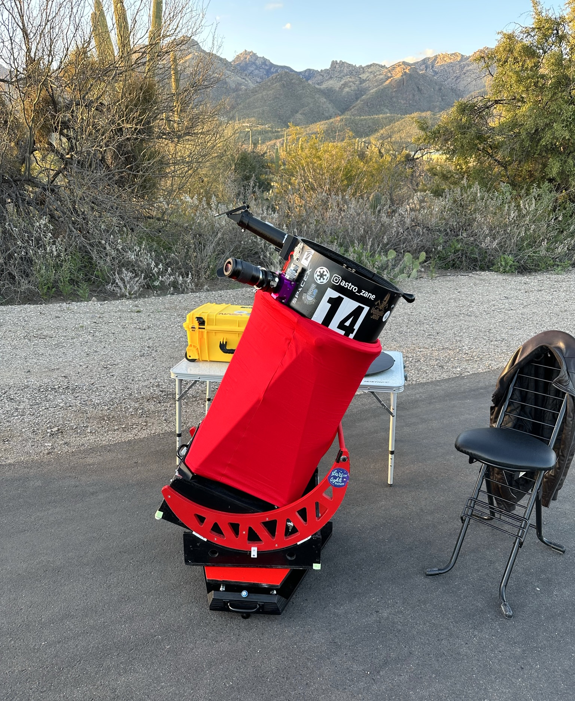
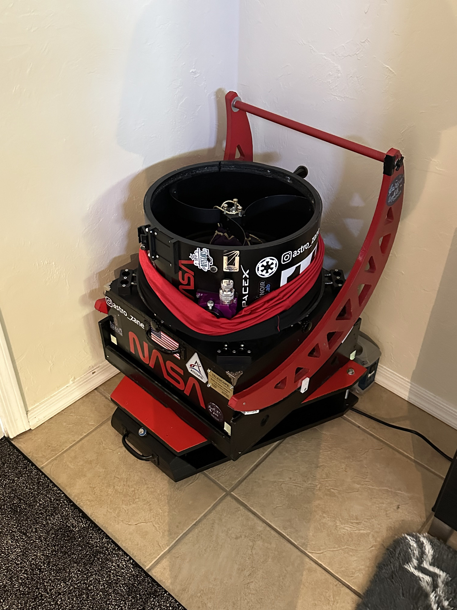
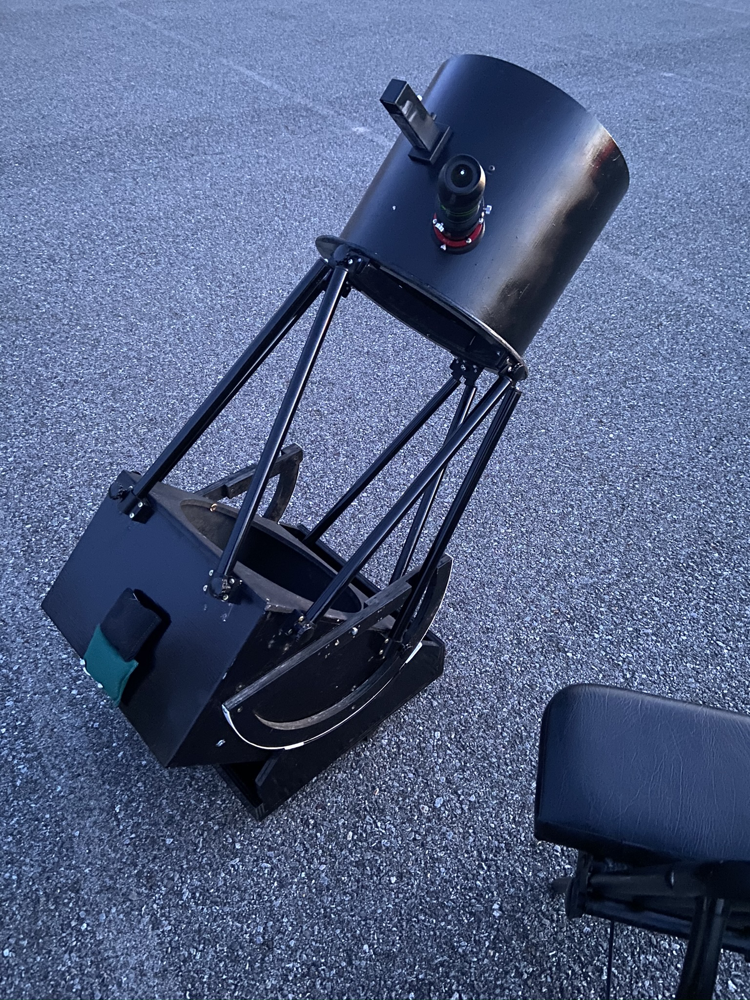
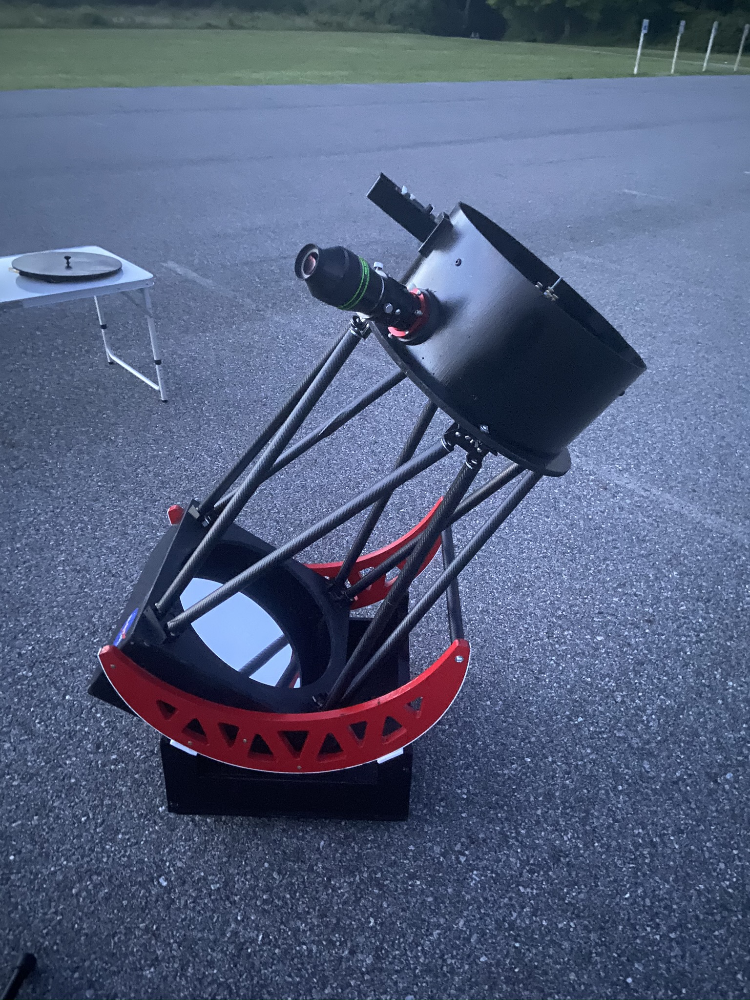
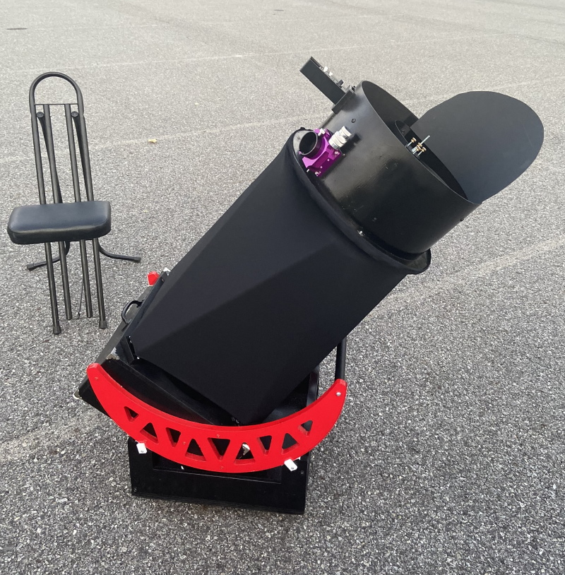
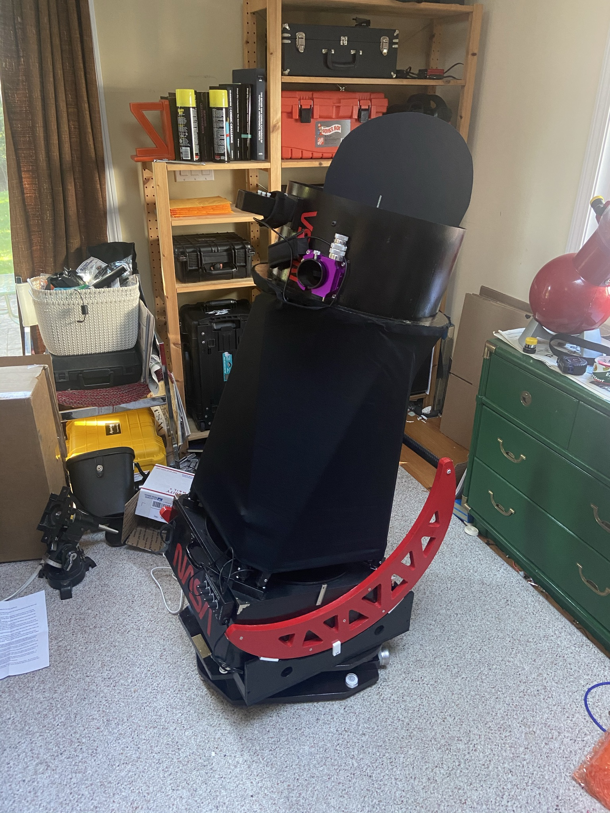
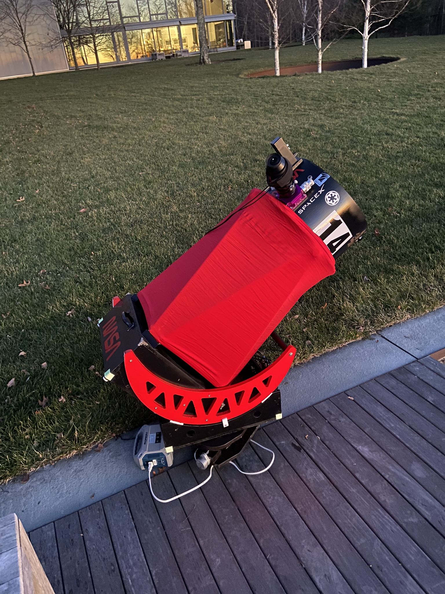
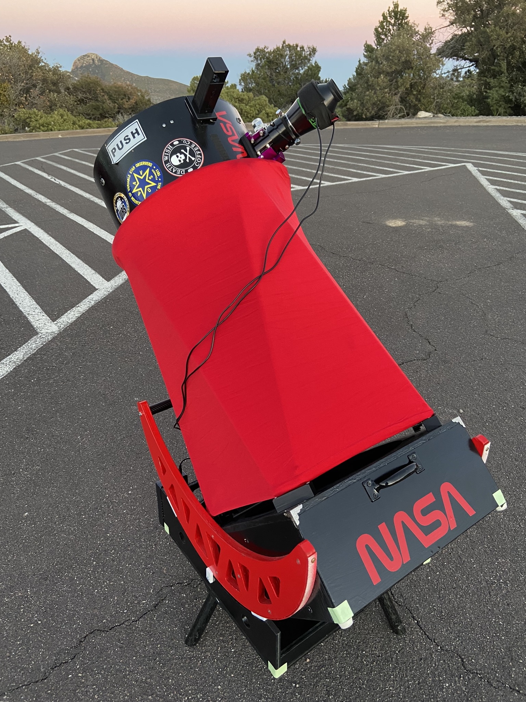

## Mk 25, latest version

My "small" Dobsonian telescope. Constructed and modified between December 2019 and January 2023, with updates still ongoing, this instrument is designed to do everything: wide-field vistas, sharp planetary views, and deep views of galaxies and globular clusters. The primary mirror is 0.8" thick quartz and made by Nova Optical.  The secondary is a 3.1" Antares unit, accurate to 1/20 wave.

The whole telescope is just 45 pounds, and fits in my passenger seat if I need it to. It can be assembled in as little as five minutes.  Before I moved to Tucson it also had an equatorial platform for motorized, hands-free tracking - something all my other scopes lack. With a 21mm Ethos eyepiece, I can get a 1.7-degree true field of view - 3.5 full Moons across! Currently working on the 30th revision to it, featuring a new mirror cell.

# Version History

## Mk 7

* Ridiculously tall upper tube assembly
* Bearings were too small
* Siliconed mirror warped severely at high magnifications
* Needed counterweights
* HC-2 focuser

## Mk 11

* Trimmed upper tube assembly and mirror box
* New rocker box and bigger bearings
* Ball and socket pole clamps
* Better mirror edge support

## Mk 14

* Moonlite focuser
* Baffle
* Shroud

## Mk 15

* Fans, dew heater controller & battery
* EQ platform for 42 North latitude
* New rocker box

## Mk 19

* Reinforced upper cage
* Baffle removed
* New shroud from Shrouds by HEater

## Mk 20

* Temporarily no EQ platform due to moving 10 degrees south to Arizona
* Future upgrades added a new platform and a QuInsight finder in place of the Rigel