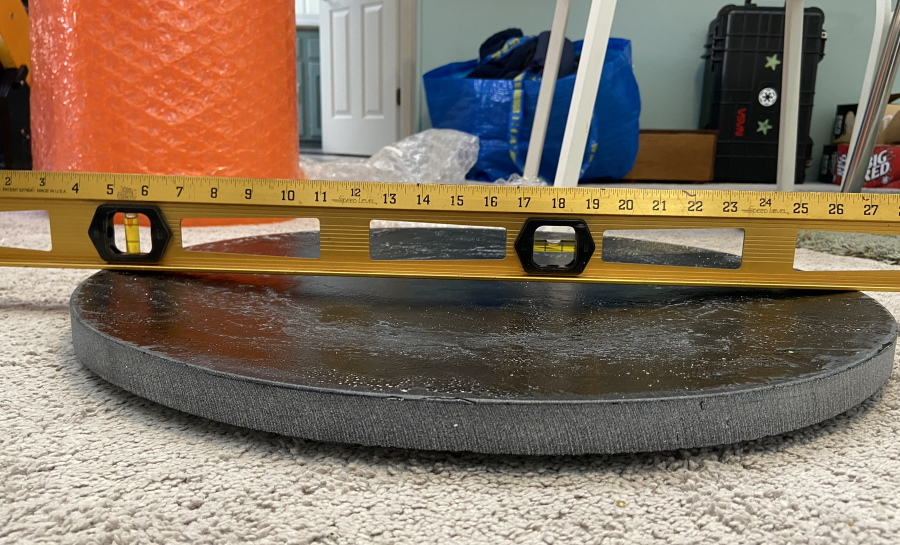

This project will consist of a 22" f/2.8 meniscus mirror made out of BVC, and a telescope based around it. The 22" is to replace my 24" scope, which I sold in 2022. The blank weighs only 38 pounds, which is not the lightest but it's better than the 60 pounds of the 24". It's 1" thick with a 0.5" deep curve (sagitta) so it acts about as stiff as a 1.5" thick typical blank, which most people would consider fairly reasonable. I could've gone thinner but wanted to alleviate the risk seeing as it's already going to be the largest and most difficult mirror I've ever done.

Originally I had 2 blanks - BVCTek made a second due to a minor cosmetic defect in the first. I gave the second one to a friend in Belgium who is currently at the polishing stage.

The finished scope will be 5 feet tall, less than 70 pounds, and fit in a Prius if need be. The idea is to have a fairly convenient instrument that acts more like a scaled-up version of my 14.7" scope and less like a dinosaur Obsession clone. Using composite construction, etc. this is feasible. 

