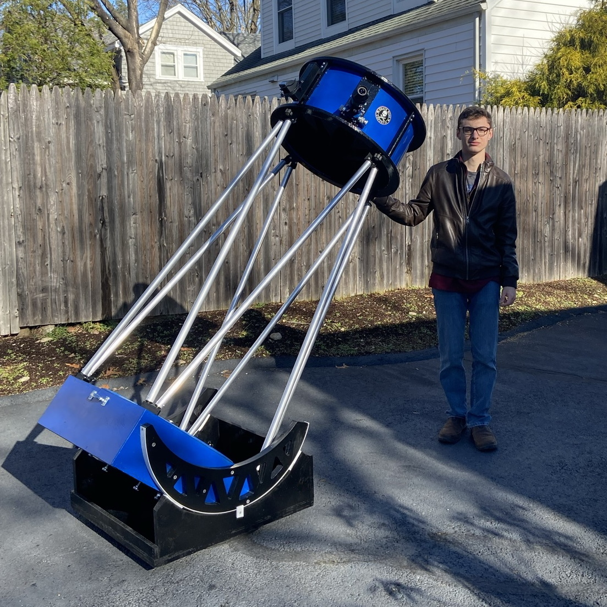
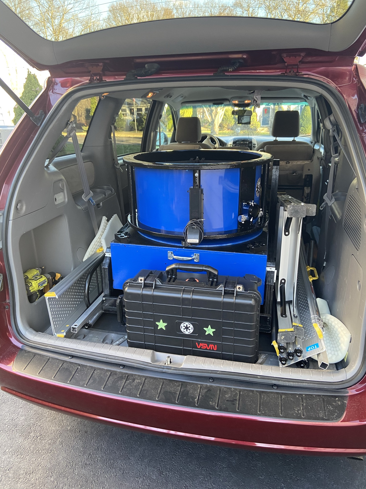
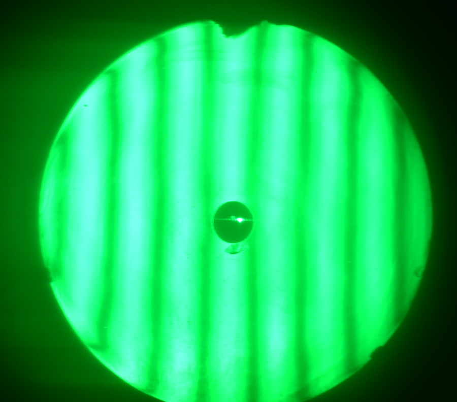
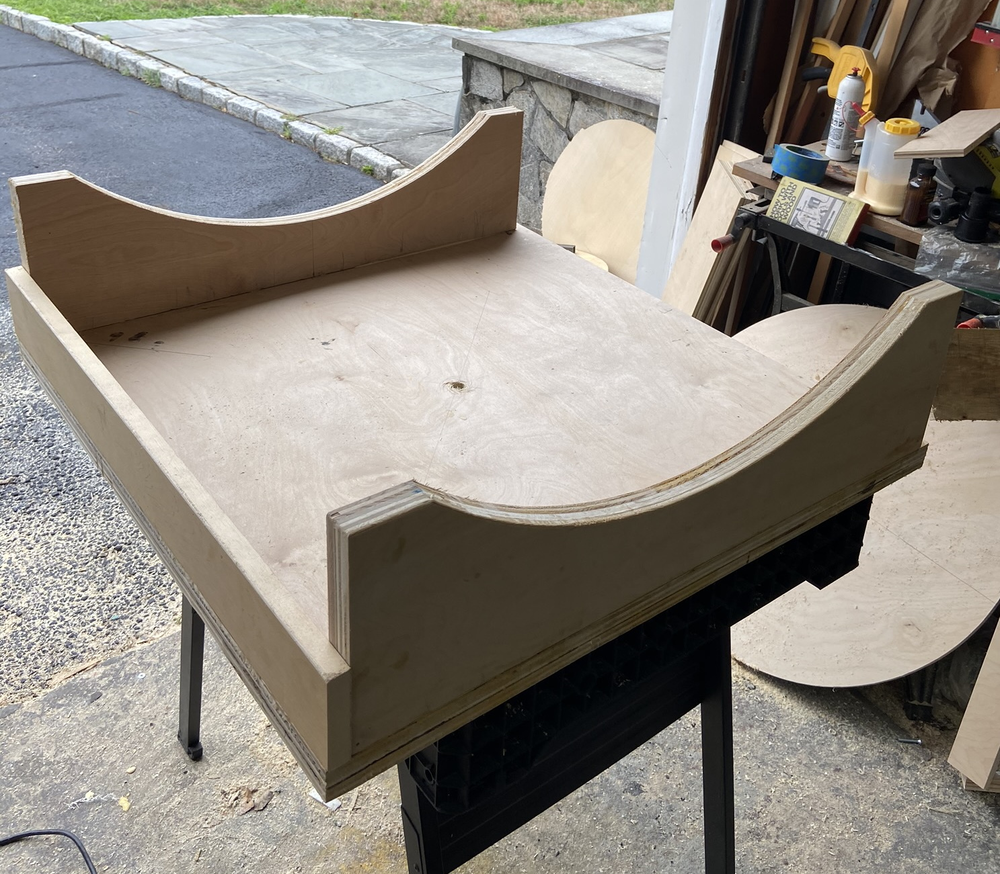
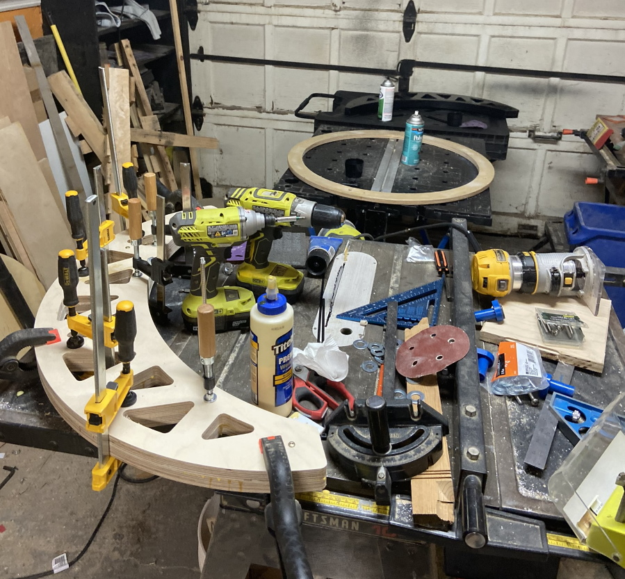

# 24-Inch f/3.5 Dobsonian Telescope

My largest telescope so far, with a primary mirror made by Nova Optical. I got the primary at a steep discount thanks to a small edge chip. Other than the 25" Obsession at WAS, my 24" was the largest telescope in Connecticut while I lived there.

The original scope weighed about 200 pounds and was transported in my Toyota Sienna minivan with a pneumatic tire/wheelbarrow handle system and handicap ramps. Setup time was roughly 30 minutes. The eyepiece is almost always reachable with little more than a short step stool and is low enough to stand on the ground about 50% of the time.  

The 24" was designed mainly for viewing galaxies, globular star clusters, and planetary nebulae. With a 2454mm focal length (a bit longer than a C9.25), it's unable to get a field of view much bigger than 3/4 of a degree, and I'm boxed in at magnifications above 100x at essentially all times. Such are the compromises of all large scopes.

Unlike my previous builds, I designed, welded, and constructed the mirror cell on this instrument and had to learn a fair amount of metalworking to connect and tap/thread all of the steel and aluminum pieces. I also learned how to work with composite materials and join together multiple layers of plywood.

The scope was rebuilt in late 2021 for a lighter weight, but I never used it much after moving to Tucson, so it is now in a new home in California.

