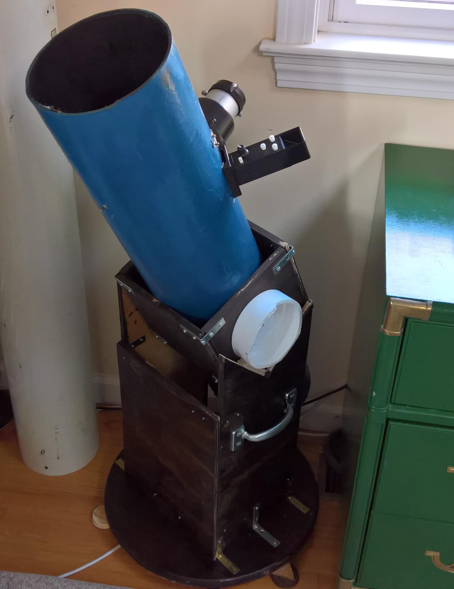
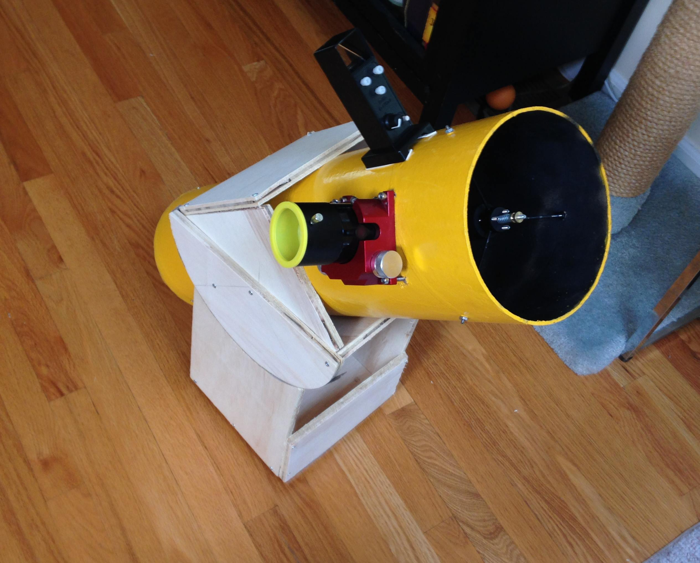
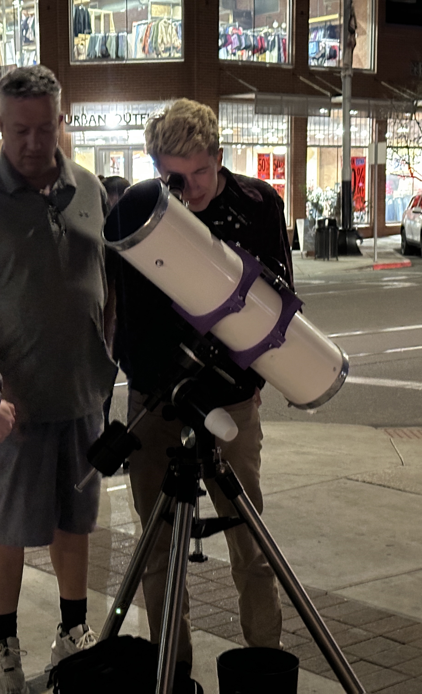

## V1
This was my first homemade telescope, and the only one I currently possess with a homemade mirror.. I ground and polished the mirror myself in August 2017 when I was 14 years old. The mirror is very good, but none of the structures I threw it in were anything resembling decent - though it did win 1st place Junior award at Stellafane 2018. I had a lot of good views with it, but dismantled it after a while. This scope made it into Sky & Telescope in September 2018. 

## V2

The second incarnation of the structure made it into TIME, The Guardian, and National Geographic. It had a Moonlite focuser and a slightly improved mount.

## V3

The fifth and most recent incarnation of the scope uses 3D-printed parts printed on my Bambu P1S out of ASA and PLA, a fiberglass tube from an older telescope, and sits atop a Vixen Super Polaris mount.

