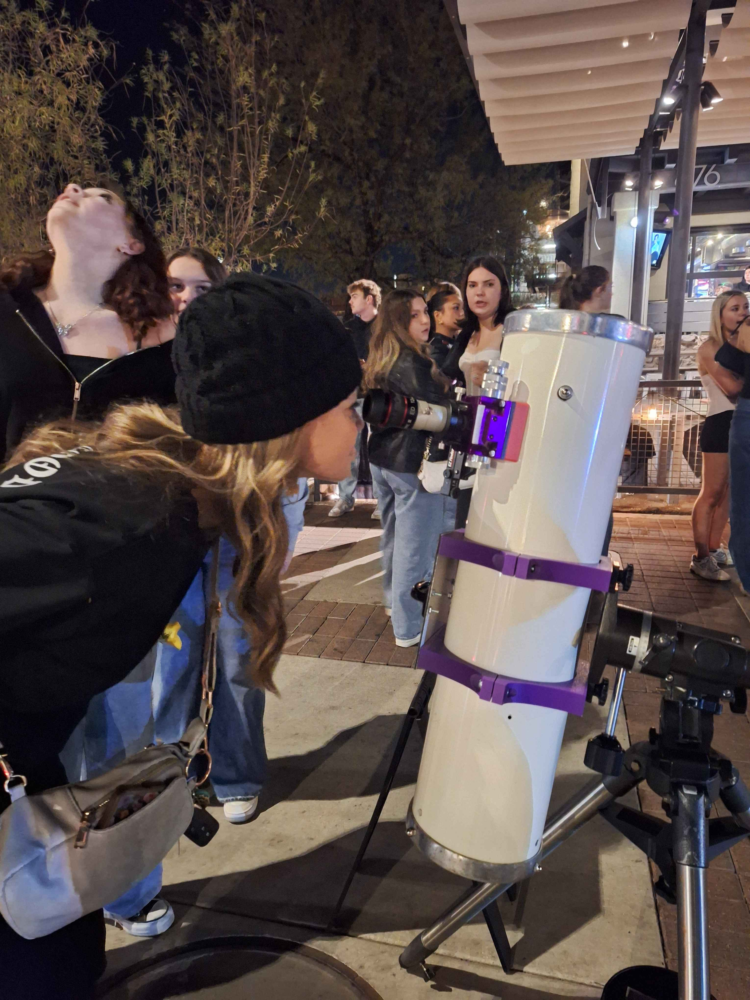

This was my first homemade telescope. I ground and polished the mirror myself in August 2017 when I was 14 years old. The mirror is very good, but none of the structures I threw it in when I was a kid were anything resembling decent - though it did win 1st place Junior award at Stellafane 2018. 

The latest version uses 3D-printed parts printed on my Bambu P1S out of ASA and PLA, a fiberglass tube from an older telescope, and sits atop a Vixen Super Polaris mount.

The mirror is about 1/8 wave P-V; I spent a lot of time tackling a turned down edge during figuring. So far it is the only *good* mirror I have made; I would like to change that in the near future.

This scope made it into Sky & Telescope in September 2018. The second incarnation of the structure made it into TIME, The Guardian, and National Geographic.

The fifth and most recent incarnation of the scope 

