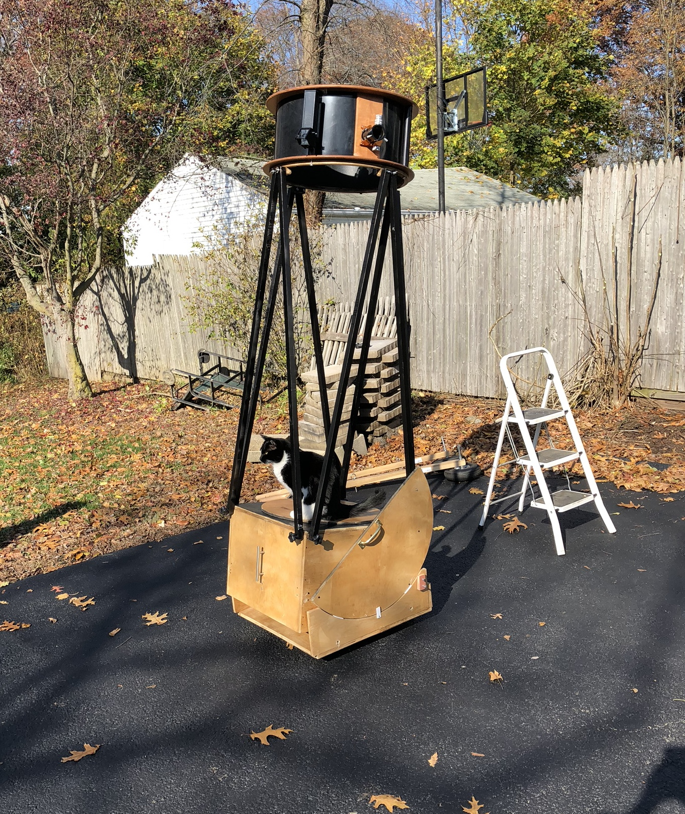
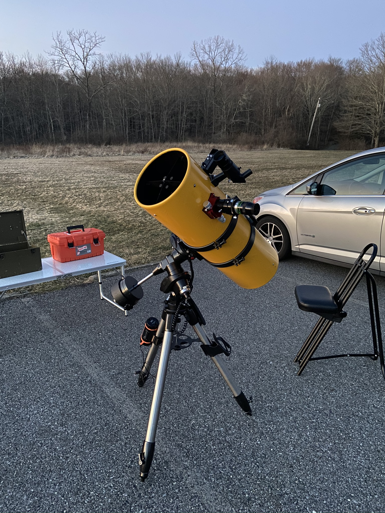
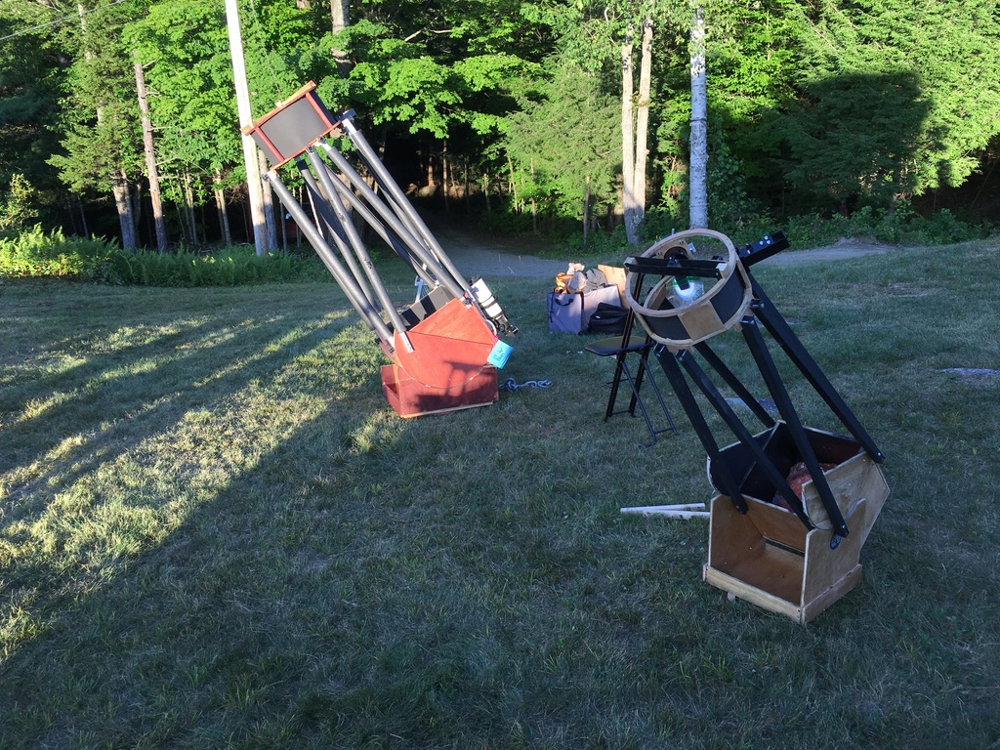
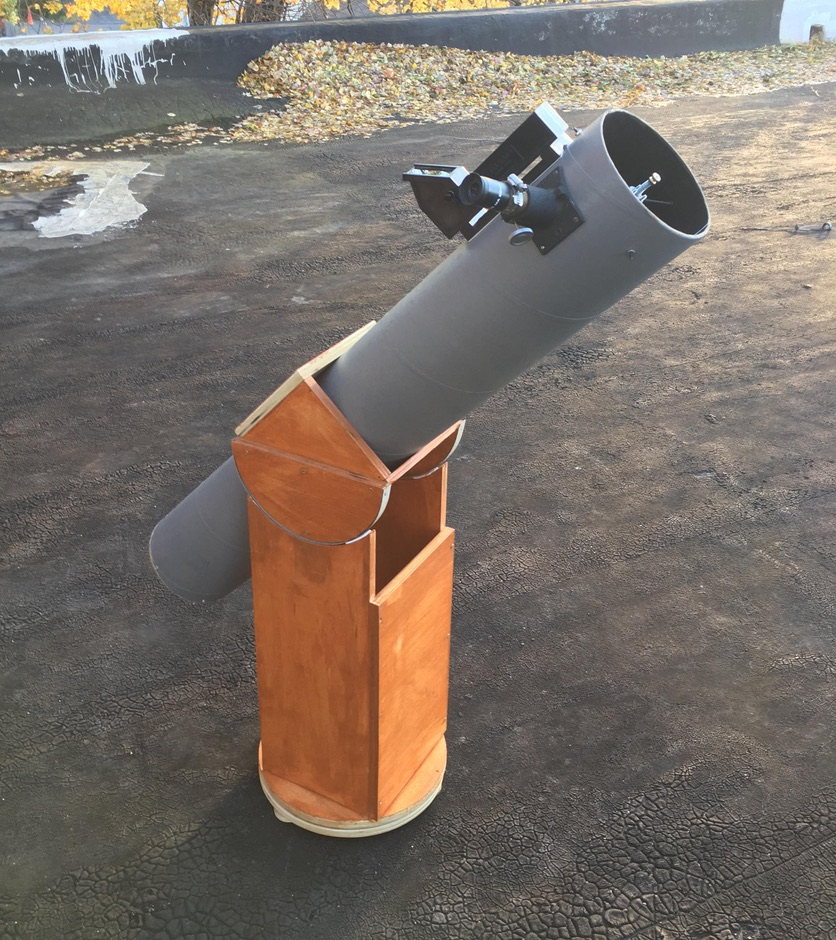
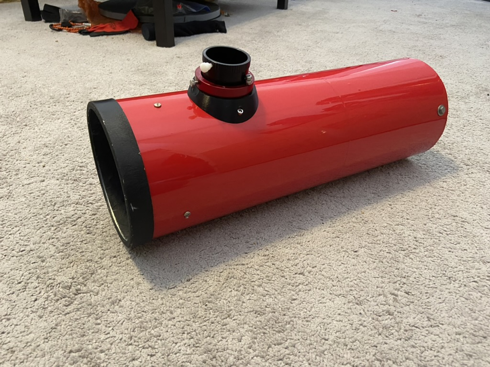
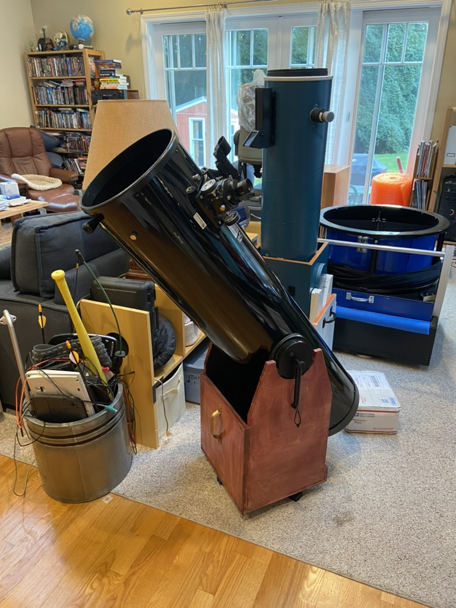

# Builds

## 20.5-Inch f/4.5 Dobsonian Telescope

A partially unsuccessful project, but an adventure nonetheless. I got a 20.5" BVC primary mirror for free and was told the figure was adequate. As it later turned out, the mirror was absolutely horrible and could not handle powers above around 180x. The construction was also rather shoddy, with bearings that flexed side to side and a truly atrocious mirror cell. The scope was also more or less permanently assembled and could only be used by rolling it out from my garage on wheels. I spray-silvered the primary mirror, and while the coating was ugly, it gave ridiculously bright images - the scope hit 18th magnitude from my Bortle 6 backyard.

I ultimately scrapped the 20.5" when I realized its deficiencies, leading to the 12" Dobsonian and a period where I only used commercial scopes. While the telescope was terrible, I still saw a lot of cool stuff and learned many lessons from it.

## 10-Inch f/3.2 Newtonian Telescope

This scope was built in early 2020 using a mirror made by Logan Nicholson of Melbourne, Australia. Unlike all of my other homemade telescopes, this one was an equatorially mounted rather than a Dobsonian, mostly because the stubby 30" long tube was too short for a true Dobsonian mounting while at the same time the immense 29-pound weight meant it would be far too heavy for a tabletop telescope. I used an aluminum tube from Hastings Irrigation and a mirror cell from Orion Optics UK, and mounted the scope on an old Celestron ASGT. While it worked very well, the equatorial configuration frequently put the telescope's eyepiece in rather irritating positions, and the total assembly weighed about 100 pounds. I ended up ditching the scope for my 14.7" f/2.9.

## 10-Inch f/5.6 Dobsonian Telescope

I built this scope with a Coulter mirror and it gave me really good views of Mars. Sold it for parts after a while.

## 6-Inch f/8.1 Dobsonian Telescope

Built for a class at a local maker space, the person doing it quit because he didn't like sawdust(!!). Used Criterion optics and focuser with a Sonotube.

## 6-Inch f/3 Handheld Telescope

Built using some salvaged optics, a HC-2 focuser, fiberglass tube and a HC-2 focuser. Worked pretty well but was unnecessary alongside my 6" f/4 so I sold it.

# Other Projects

## Replacement Dob Bases

